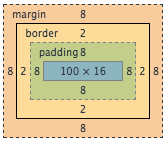

# Class5 - CSS, Development Style and Grace

## Separation of Concerns

Client-side web development is dominated by three technologies.

- **HTML** specifies the _structure_ and _content_ of a webpage.
- **CSS** specifies the _presentation_ or _appearance_ of elements on a webpage.
- **JavaScript** lets the developer create _interactive_ elements. It's how the client communicates with the server and the user.

Before CSS, HTML was also used to control the appearance of webpages. This is why websites from the '90s look terrible.

These three technologies embody the principle of _separation of concerns_ — they are each completely responsible for a single aspect of a complex web app.

## App file structure/hierarchy

- **/models** - contains ORM models (mongoose `Schemas`)
- **/views** - view-templates
- **/public** - all static content
  - **/images**
  - **/stylesheets**
  - **/javascripts**
- **/routes** - all express routes, separated by app module/area
- **/tests** - for unit-tests
- **/node_modules** - created by `npm`

## CSS

Open up [Codepen](http://codepen.io/pen/), we're going to learn CSS!

CSS (cascading style sheets) is the language that makes the web pretty. It lets us describe the **look and formatting** of HTML elements. In this way, it *separates the concern* of the style of the page from all other aspects of a web app. In the early days of the web, HTML was also responsible for this, but all HTML formatting and style directives are now deprecated in favor of CSS.

Every HTML element can be styled by CSS. Elements can be styled by tag name, class, id, and more. Below is an example of basic CSS syntax:

```css
selector {
  property: value;
  property: value;
  ...
}
```

Properties can be named in any order, but in the case of directly conflicting properties, the last one defined will apply. Many property names are fairly self-explanatory, but the [full property table](http://www.w3.org/TR/CSS21/propidx.html) may serve as a useful reference. Or Google.

### Units

Many properties values are lengths, which can be specified in many different ways in CSS. The units below are the most common.

| Unit  | Description |
|----|----|
| `px` | Usually a single pixel on the client's screen (a line of width `1px` is guaranteed to be "sharp and visible")
| `em` | Relative to the font-size of the element (`0.5em` is half of the current font-size)
| `%` | Percent of the parent element along the relevant dimension (horizontally or vertically)

CSS also supports the absolute units `cm`, `mm`, `in`, `pt`, and `pc`, but these are better suited for print than the screen.

### Selectors and Specificity

The most common selector is a `tagname`, a `class` (preceded by `.`), or an `id` (preceded by `#`), though there are many other ways to select elements to style.

Styles of elements _cascade_ (apply) to their child elements. In cases where multiple conflicting styles are applied to an element, _the more specific style prevails_.

So with this document:

```css
<div class="styled">Content</div>
```

and this style:

```css
div {
  color white;
  background-color: red;
}

.styled {
  background-color: blue;
}
```

The single `div` in the document will have a blue background color because the selector `.styled` is more specific than `div`. Paste the above into [Codepen](http://codepen.io/pen/) to test it out.

### Colors

A quick aside on colors, which can be specified in CSS in multiple ways.

| Method | Description |
|----|----
| `#RRGGBB` | Red, green, and blue are each specified by a two-digit hex number, `00` to `FF`. White is `#FFFFFF` and black is `#000000`.
| `#RGB` | Same as above but with half the precision.
| `name` | Certain colors (like red, blue, yellow, etc.) can be specified simply by name. They're mostly hideous but black and white are fine.
| `rgb(r,g,b)` | Red, green, and blue are specified on a 0-255 scale.
| `rgba(r,g,b,a)` | Same as above, but alpha (opacity) is specified on a 0-1 scale.

Here's a neat [clock](http://whatcolourisit.scn9a.org) that displays the color specified by the hex code corresponding to the current time.

### Box Model

All HTML elements can be modeled as boxes. CSS allows us to modify that box to affect the display of content. Below is the styling for a box and its corresponding box model. The properties under `/* metrics */` determine the size of the box and the spacing of its contents.

```css
.styled {
  background-color: blue;
  color: white;
  text-align: center;
  
  /* metrics */
  margin: 8px;
  border: 2px dotted black;
  padding: 8px;
  width: 100px;
}
```



In the image above, the solid border around the yellow box defines the outer edge of the element. The `margin` is space between the box and its surroundings. The `border` is space between the outer edge and the `padding`, which defines the space between the inner edge of the border and the content of the element.

As the image above shows, the `width` property sets the width of the *content*, not the width of the entire element. This means that `padding` and `border` add to the apparent dimensions of the box. We can add the below property to change that:

```css
box-sizing: border-box;
```

With this property set, the `width` and `height` properties set the dimensions of the box, and those dimensions are not affected by `padding` or `border`.

Try playing with these properties in Codepen to see the effect of `box-sizing: border-box`.

## Cookies

A cookie is a key-value store that lives on the client and can be read and modified by a website. In express, cookies are stored in `req.cookies`. I added `console.log(req.cookies)` to see what my cookies look like:

```bash
{ 'connect.sid': 's:oJzNzHd1WX-xlEBtpFoy7VoP4UzoqTQ8.VjMIMfdIZqI0oLGy1zh5JwWPbdost5USN9jFYeL9ITY' }
```

As you can see, a cookie is a key-value store that our cookier parser has converted to JSON. This is probably a unique ID that we can use to associate a cookie with other data stored on the client.

## Sessions

One of the most common ways to use cookies is to keep track of "sessions". A session stores data specific to a given client that can only be accessed by that client (based on the client's cookie identity). Here are the results of `console.dir(req.session)`.

```bash
{ cookie:
   { path: '/',
     _expires: null,
     originalMaxAge: null,
     httpOnly: true } }
```

The session object (managed by the `express-session` middleware) stores a reference to the client's cookie. `_expires` is a deprecated property that specifies the time at which the cookie should expire. Cookies usually have a maximum age set – if the max age is `null`, the cookie will last for the life of the browser session, which is perfect for our needs.

The session object is stored locally on the server, so we can modify it directly:

```node
if (req.session.counter)
	req.session.counter++;
else
	req.session.counter = 1;
```

This code checks for the `counter` property and adds it if it doesn't exist. Next time that user accesses the page, `req.session.counter` is incremented. Here's the result after refreshing the page a few times:

```node
{ cookie:
   { path: '/',
     _expires: null,
     originalMaxAge: null,
     httpOnly: true },
  counter: 4 }
```

Basically, sessions allow websites to keep track of user-specific data for as long as a user keeps their cookies (or until the cookies become invalid, either from expiring or server refresh).

## Error Handling

By now you've probably seen a lot of errors in your console. Handling errors well is key to writing robust Node apps.

### Operational vs. Programmer

**Operational errors** are problems that the user can experience while running your program that are not caused by errors with your program's code. The user's system could be out of memory, or the user could supply invalid input.

**Programmer errors** are bugs in the program code that can be resolved by fixing the code.

Even correct programs cannot avoid all operation errors, so they must handle them correctly. It's up to the programmer both to avoid programmer errors (by writing good code and debugging effectively — we'll cover this later), and to _handle_ operational errors as gracefully as possible.

### Asynchronous Error Handling

The standard method signature for a Node callback is this:

```node
function(err, result) {
	...
}
```

If there was no error, `err` is `null` and `result` is not. Otherwise, `err` is _not_ `null` and result is. This is about the simplest way to handle errors:

```node
function(err, result) {
	if (err)
		return console.error(err);
	...
}
```

We can do much more sophisticated things, from attempting to recover from the error to simply informing the user of the error (`console.error` prints to the server console, so the client is never informed).

Most of our functions are asynchronous (callbacks), so this is a very common way to handle errors in Node. We may cover other ways to handle errors in future classes or deep dives.

### Response Status

As we touched on in class 1, there are [many HTTP status codes](http://en.wikipedia.org/wiki/List_of_HTTP_status_codes). Express makes it easy to set the status of a response. You can simply chain a call to `status` in your response, like this:

```node
res.status(404).render('error_404', { data })
...
res.status(500).json({ error: 'message' })
```

Whenever possible, you should set the appropriate response status in this way.

#### Joyent has great documentation on error handling in Node [here](https://www.joyent.com/developers/node/design/errors).

## Debugging

Learning how to debug is one of the most important things you can get out of learning to program. It's a skill you'll use everywhere, every day. You already do.

### Know your entire system

Effectively debugging a system means debugging it in context. Your Node webserver runs from your UNIX terminal running on a distribution of Linux, on a computer connected to the internet through a wireless router or ethernet connection. To debug effectively, you have to acknowledge that any part of your system could break and cause problems.

### Read error messages and stack traces

Error messages are not bad. They exist to help you! Without them, you would have no indication of where to start when something went wrong — your app would just crash.

So you should always read them. Focus on the parts of the error message that you understand.

_Google error messages!_

### Remember that someone else has done this before

Someone else has already found your error and asked about it on the internet — this is why Googling your error messages is so helpful. You'll often find an answered StackOverflow question. This is the best place to start — error messages are designed to be helpful, but they only contain so much information on their own.

### Know your tools

#### The Console

Calls to `console.log`, exceptions, and stack traces go to the console. Both the client and server have consoles — server-side JavaScript outputs to the server console, client-side JavaScript to the client console in the browser.

In your development environment, the client console is your browser console, and the server console is the Terminal you run your Node app from. When you deploy to Heroku, you can access your server console output with `heroku logs`.

It's easy to go very far down a debugging path only to realize that it was the wrong path. One of the most difficult things about debugging is deciding where to start.

### Know that you have full control

The computer doesn't know what you mean, just what you say. Programming is an exercise of boiling down your understanding of a problem to something a machine can understand. The computer does exactly what you tell it to do, 100% of the time.

_All the time._

This means that no matter what, something you did is always responsible for the behavior of your program. In one sense, every error is your fault. But more importantly, _you always have complete control_. If you can break your program, you can make it run.

_Starting with something that works_ and _making incremental changes_ are the two best ways to maintain an understanding of how the code you write controls the behavior of your program.

**Git** is a fantastic enabler in this endeavor!