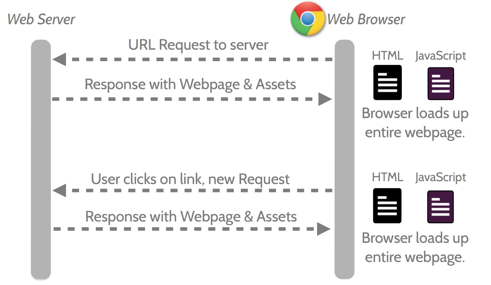
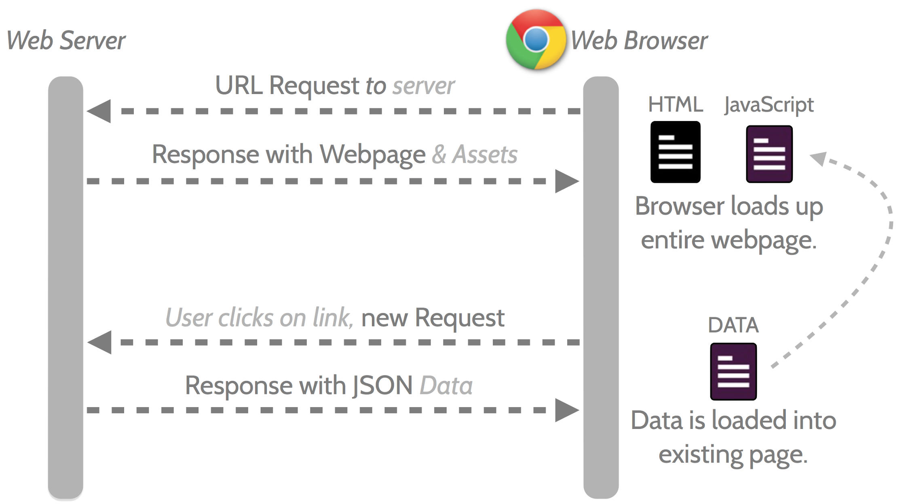
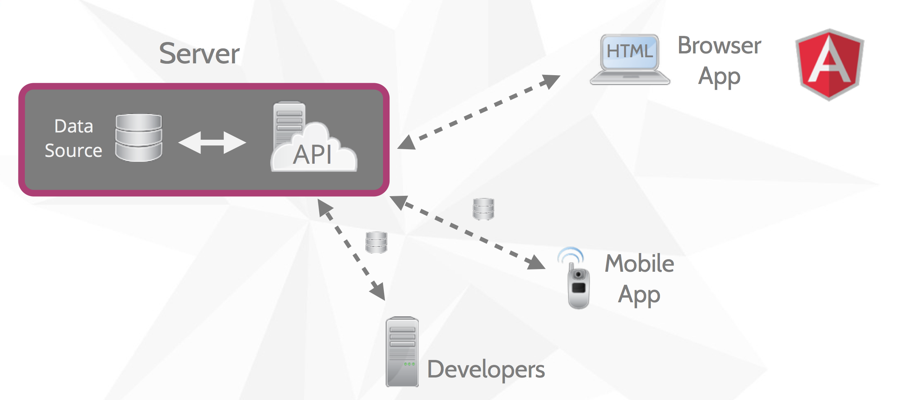

#Class 10 - Client-side Javascript Frameworks

##Intro
So far we have seen how to organize an increasingly complex system of components on our node server. 
We will now take a side step to discuss another organizational system in which instead of having lot of structure on the server, we have that structure on the client. 

##Basic Idea
In our traditional system, with most clicks you make a call to your server for an html page.
You have seen how this can work with templating by rendering html on the server and then sending it across to the client as just html. 
The image below shows this traditional system: 

But what if instead of having to load an entire HTML document every time, you simply send only the necessary pieces of data and then change the html using Javascript code. 
You have tried doing this before, most notably in the burger ordering homework. 
You probably noticed how messy that got for even a simple application. 
You also know about APIs and how you can retrieve structured data and show it on your page. 
Now consider a different structure in which almost your entire server is simply an API that sends data to a single page that changes appropriately. 
In this structure the server would serve only a few different assets and include an API that can be used to request the necessary data.
In that case the communications would look like this: 

This clearly has the benefit of almost certainly lowering the amount of data that is transferred between the server and the client, which also lowers the loading time when clicking on links. 
Another benefit of this application structure is that the API component can be used for many other purposes, such as mobile applications or even to other developers who want to expand on your websites functionality, as diagrammed below:

You may wonder why this is not how it has always been done. The simple answer to this is that it is only recently that Javascript, browsers, and computers have gotten good enough to reliably utilize these client-side frameworks. If you were going to do anything interesting, you had to do it on the server. In addition, this method may be more labor intensive for certain projects and can be a tricky adjustment to make. You will get to explore some of these strengths and weaknesses in the next lab assignment when you tackle one of these frameworks yourself. 

##Your First Client Templating:
So you are all very familiar with server side templating using handlebars. 
In the class10 folder there is an in_class folder containing the cat app that you are all familiar with. 
We are going to uncomment code to transform just one of the routes into an API endpoint and then use handlebars on the client side to render the content. 

You can probably imagine that organizing a very complex application with dozens of pages and models can get really complicated and messy really fast. 
Luckily, there are really fantastic publically available and free frameworks you can utilize to organize your application. 
We will explore these in a bit. 

##MVC on the client
We talked last class about MVC. 
Hopefully you all have an appreciation for the nice structure and separation of concerns it affords you. 
When we restructure our application for the client side, we now move that organizational structure to the client side as well. 
The direct implementation will differ based on the specific framework, but in general you will organize your views as templates that you load in only once when the first page loads. 
The models are organized javascript objects with some additional functionality such as a link to an API endpoint that can be used to retrieve and update data. 
The controller is also on the client where it handles rendering the templates using the appropriate model data.

##Popular Frameworks:
It turns out that there are a TON of different javascript client-side frameworks to choose from for any project. 
These frameworks have various strengths and weaknesses. 
The source code for all of these frameworks are available on github (and yes, you can fork them). 

Framework | Github | Homepage
--- |---|---|
Angular | https://github.com/angular | https://angularjs.org/
Backbone | https://github.com/jashkenas/backbone | http://backbonejs.org/
Ember | https://github.com/emberjs/ember.js/ | http://emberjs.com/
React | https://github.com/facebook/react | http://facebook.github.io/react/
Flight | https://github.com/flightjs/flight | https://flightjs.github.io/
Knockout | https://github.com/knockout/knockout | http://knockoutjs.com/
Riot | https://github.com/muut/riotjs | https://muut.com/riotjs/

Every framework have different features and organizational structures. Best way to understand these differences is to visit the webpage of the framework and just try to implement some very basic system in the framework. 

###Backbone
Backbone is one of the earlier client side frameworks that hit the scene. 
It doesn't actually have a separate controller and just puts the controller logic in the view (bad form). 
It has models that you can specify data elements of and easily connect it to your server. 

###Ember
Definitely one of (if not the) most complicated and uniquely organized frameworks.
In addition to views, models, and controllers it has many other systems and subsystems that allow interesting functionality. 
Quote from the top of their web page: "A framework for creating **ambitious** web applications"

###Angular
Angular is developed by Google and has as its chief aim to make html what it would be if it was created today.
It has several interesting qualities such as html directives.
A primary focus of angular is to build for testability and it has functionality to help enable exactly that. 

###React
Developed by Facebook and focuses on the view part of MVC.
Mission statement is to allow users to create large applications with data that changes over time.
Allows its views to update as the data changes. 

##Approaches to learning a framework 
As you almost certainly are aware, for any material (such as a framework) there are dozens of ways to learn a framework. A big part of the upcoming lab is learning a framework and presenting on what you found effective in learning that framework. There are a couple of approaches you can take to learning any new framework or library and we will be going over a few of them here.

###Documentation
Any framework or library will always have documentation that you can read through to understand the independent functions and components. If done well, this documentation can be useful towards helping you understand the options available to you, as well as being vital as a quick check on the signature of functions and such. The drawback of these is that documentation is often poor, technical, and doesn't give a very good high level idea of the patterns of the framework. 

###Third-Party Explanations / Courses
For lots of popular frameworks, there are often lots of people who have created excellent walkthroughs of the framework. They (often) do a good job of taking the listener through a logical explanation of the framework, building on top of content previously explained, and showing how you can build an actual application with the framework. These can, however, take some time to go through, cost money, and depending on your skill/ familiarity they can feel too fast or too slow. You should be able to find plenty by simply Googling "____ tutorial" but if you are stuck, here are some popular possibilities: 
- https://egghead.io/ (Angular and React)
- https://www.codeschool.com/ (Backbone, Ember, & Angular)(warning: paid service)
- http://emberjs.com/guides/ (Ember)
- http://arturadib.com/hello-backbonejs/ (Backbone)

###Sample Apps
There are applications that are written specifically as example applications to show how to put an application together with actual functionality. These can be found often from the framework publishers themselves, but also from people who just want to share. One excellent page that has a sample app for many frameworks is: http://todomvc.com/

Additionally, if the framework is popular enough, it likely also has hundreds of actual applications that have been written in the framework and are publically available. All these can be sources of learning from experts who likely are very familiar with the framework. They can, however, be very hard to dig through and are by no means necessarily well done or structured so you shouldn't take them as the only or best way to use the framework. 
