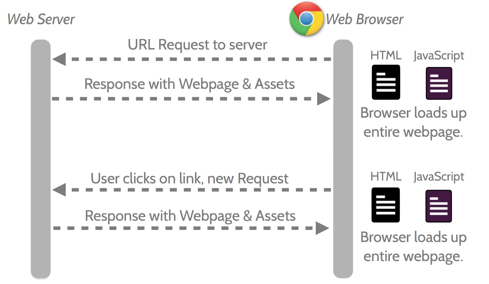
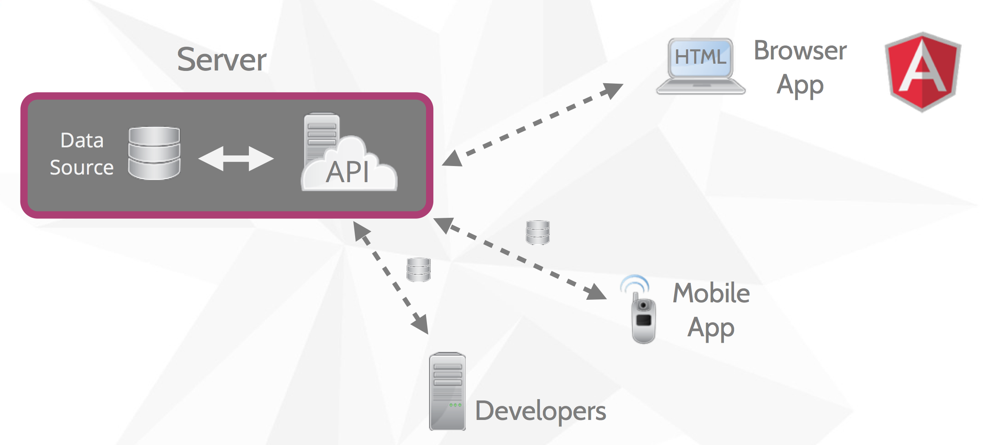

#Class 10 - Client-side Javascript Frameworks

##Intro
So far we have seen how to organize an increasingly complex system of components on our node server. We will now take a side step to discuss another organizational system in which instead of having lot of structure on the server, we have that structure on the client. 
##Basic Idea
In the traditional system, with every click there is a sending of html along with all the necessary assets. You have seen how this can work with templating by rendering html on the server and then sending it across. The image below shows this traditional system: 

But what if instead of having to load an entire HTML document, you simply send only the necessary pieces of data and then change the html using Javascript code. In this structure the server would serve only a few different assets and include an API that can be used to request the necessary data. In that case the communications would look like this: 

This clearly has the benefit of almost certainly lowering the amount of data that is transferred between the server and the client, which also lowers the loading time when clicking on links. Another benefit of this application structure is that the API component can be used for many other purposes, such as mobile applications or even to other developers who want to expand on your websites functionality, as diagrammed below:

You may wonder why this is not how it has always been done. The simple answer to this is that it is only recently that Javascript, browsers, and computers have gotten good enough to reliably utilize these client-side frameworks. If you were going to do anything interesting, you had to do it on the server. In addition, this method may be more labor intesive for certain projects. You will get to explore some of these strengths and weaknesses in the next lab assignment when you tackle one of these frameworks yourself. 

##MVC on the client

##Your First Client Templating:
[Handlebars  in-class templating]

You can probably imagine that organizing a very complex application with dozens of pages and hundreds of models can get really complicated and messy really fast. Luckily, there are really fantastic publically available and free frameworks you can utilize to organize your application. We will explore these next. 

##Popular Frameworks:
It turns out that there are a TON of different javascript client-side frameworks to choose from for any project. These frameworks have various strengths and weaknesses. The source code for all of these frameworks are available on github (and yes, you can fork them). A chart of their popularity (as measured by number of stars is show below)

[Find out about framework popularity]
[Angular: 35,118]
[Backbone: 20,709]
[Ember: 12,683]
[Flight: 5,865]
[Knockout: 6,034]
[React: 15,670]
[Riot: 5,110]

Every framework have different features and organizational structures. Best way to understand these differences is to visit the webpage of the framework and just try to implement some very basic system in the framework. 

###Backbone

###Ember

###Angular

##Approaches to learning a framework 
As you almost certainly are aware, for any material (such as a framework) there are dozens of ways to learn a framework. A big part of the upcoming lab is learning a framework and presenting on what you found effective in learning that framework. There are a couple of approaches you can take to learning any new framework or library and we will be going over a few of them here.

###Documentation
Any framework or library will always have documentation that you can read through to understand the independent functions and components. If done well, this documentation can be useful towards helping you understand the options available to you, as well as being vital as a quick check on the signature of functions and such. The drawback of these is that documentation is often poor, technical, and doesn't give a very good high level idea of the patterns of the framework. 

###Third-Party Explanations / Courses
For lots of popular frameworks, there are often lots of people who have created excellent walkthroughts of the framework. They (often) do a good job of taking the listener through a logical explanation of the framework, building on top of content previously explained, and showing how you can build an actual application with the framework. These can, however, take some time to go through, cost money, and depending on your skill/ familiarity they can feel too fast or slow. 

###Sample Apps
There are applications that are written specifically as example applications to show how to put an application together with actual functionallity 

If the framework is popular enough, it likely also has hundreds of actual applications that have been written in the framework and are publically available. All these can be sources of learning from experts who likely are very familiar with the framework. They can, however, be very hard to dig through and are by no means necessarily well done or structured so you shouldn't take them as the only or best way to use the framework. 

