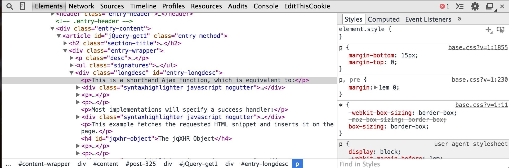

# Class 4 - The Client
Web Applications handle much of their database communication and logic on the server,
but the front-end is what the client actually sees and interacts with.
Without a clean, intuitive, responsive, and enjoyable client-side,
the best server application in the world wouldn't be much.

Today we are going to learn the basics of building and manipulating the client
and building communication routes between the client and server.

## Development Console
One of the most important and powerful tools in web development is the development console.
All modern browsers have some sort of console available, but the Chrome console is what we will use.
Its a great and common browser and very developer friendly.
### Browsers
As a quick aside, all browsers are different.
They have gotten much closer in recent years (HTML5 browsers),
but you will still run into some differences in how your sites look and function due to these differences.
It's worth understanding the different browsers with which people may view your site you so can choose what to optimize:

Some key trends to note include the rise of Chrome as well as the fall of IE and Firefox.
Also worth noting is the rapid growth of mobile browsing (pink).
We won't address [mobile web design](http://www.smashingmagazine.com/guidelines-for-mobile-web-development/) in this class,
but it is definitely something to consider before launching a new site.

Ok, back to the console.
On any webpage, right-click, and select `Inspect Element`. You'll see something like this pop up in the bottom of the window:

The dev console contains a ton of features (seriously, there are more features than I've even heard of).
We'll start with the basic tabs that you use most often:
* Elements: This is a collapsable and editable view of the HTML on the current page.
You can double-click to edit fields or [DOM](http://en.wikipedia.org/wiki/Document_Object_Model) nodes.
On the right side is a panel showing the CSS styling applied to the element you are highlighting. Again, double-click to edit.
A useful shortcut here is the magnifying glass in the top-left corner of the console.
Click that and then click in the browser somewhere to jump to the HTML of that element.
* Network: While you're in this tab, refresh the browser.
The tab will list all the requests that the web page makes, including the size, timing, and specific response.
This can be useful for debugging your server's responses or other API's.
* Sources: The holy grail of JavaScript debugging tools. Set breakpoints, step through code,
all the fun stuff that an IDE would give you. We'll get back to this when we go over debugging in more depth.
* Console: A full JavaScript console that operates in the current scope of the Javascript on the page (including inside breakpoints).
Run commands, and read through your `console.logs` in this window.
As a bonus, if you click the "console icon"  in the upper-right corner,
the console will pop up below whatever other tab you want to reference.

## HTML Reprise
We've seen some HTML before but let's go through a more formal overview of it.
[HTML](http://en.wikipedia.org/wiki/HTML) is a markup language that uses tagged elements
to describe the structure of a webpage.
Elements are specified with start and end tags which enclose their content,
including children elements (`

Hi again

`).
Some elements cannot have content or children and do not have an end tag.
Instead their start tag ends with a slash (` `)
While HTML can include presentation specifications,
it is highly recommended to use HTML for structure and [Cascading Style Sheets](http://en.wikipedia.org/wiki/Cascading_Style_Sheets) (CSS)
for define the look and layout of the page. There are *many* [HTML tags](https://developer.mozilla.org/en-US/docs/Web/HTML/Element),
but you will mostly use a small number:
* [`<a>`](https://developer.mozilla.org/en-US/docs/Web/HTML/Element/a):
The Anchor element defines a hyperlink like those seen in blue throughout this document.
* [`<article>`](https://developer.mozilla.org/en-US/docs/Web/HTML/Element/article):
Articles are used to signify a self-contained composition within a page, ei. forum post, documentation entry, newspaper article, etc.
* [`<body>`](https://developer.mozilla.org/en-US/docs/Web/HTML/Element/body):
The body tag represents the content of an HTML document. There can be only one.
* [`<canvas>`](https://developer.mozilla.org/en-US/docs/Web/HTML/Element/canvas):
A frame in which you can draw graphics through JavaScript.
This can be images and shapes and things, or some [pretty crazy applications](http://davidwalsh.name/canvas-demos).
* [`
`](https://developer.mozilla.org/en-US/docs/Web/HTML/Element/div):
Arguably the most common element, the *Division Element* is a generic HTML container element.
It doesn't inherently represent anything, but it can also be used (through CSS) to represent pretty much anything.
Usually it is used to group elements or for style. Ideally it should not be used when a semantic element like `<article>` or [`<nav>`](https://developer.mozilla.org/en-US/docs/Web/HTML/Element/div)
is appropriate, but this is not widely adhered to.
* [`<form>`](https://developer.mozilla.org/en-US/docs/Web/HTML/Element/form):
Defines a section of interactive controls and inputs that will submit information to a server.
These will usually include a number of [`<input>`](https://developer.mozilla.org/en-US/docs/Web/HTML/Element/input)
tags.
* [`<h1>`](https://developer.mozilla.org/en-US/docs/Web/HTML/Element/h1):
Header text. Pretty common, there are six tags h1 - h6. Use these rather than a `
` with a css class `header-1` or something like that.
* [``](https://developer.mozilla.org/en-US/docs/Web/HTML/Element/img):
Display an image with the image tag. `` tags cannot have children and do not have an end tag (``).
* [`<ul>`](https://developer.mozilla.org/en-US/docs/Web/HTML/Element/ul),
  [`<ol>`](https://developer.mozilla.org/en-US/docs/Web/HTML/Element/ol), and
  [`<li>`](https://developer.mozilla.org/en-US/docs/Web/HTML/Element/li):
Un-ordered list, ordered list, and list element tags are used for structuring list content in HTML.
* [`
`](https://developer.mozilla.org/en-US/docs/Web/HTML/Element/p):
The paragraph element defines a block of text.
* [`<span`](https://developer.mozilla.org/en-US/docs/Web/HTML/Element/span):
The span element is like a div in that it is a generic container element.
However, in contrast, spans are inline elements by default (they do not break the flow of elements on the page)
and are often used to style text: `
Some text
`.
* [`<table>`](https://developer.mozilla.org/en-US/docs/Web/HTML/Element/table):
Prior to the use of CSS, the table element, along with `<th>` (table header), `<tr>` (table row), and `<td>` (table data),
were often used as a method for page layout. Don't do this please.
They can still be used for the categorization of data,
but the styling and layout should all be controlled by CSS.

Check out this [site](http://www.htmldog.com/guides/css/intermediate/layout/)
or Google "HTML layout tips" to read more about formatting techniques.

## jQuery

## HTML Forms

## AJAX
