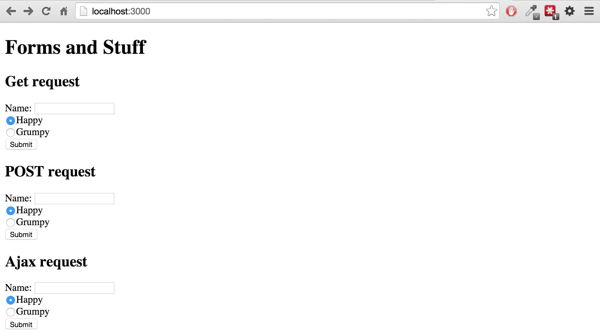

# Class 4 - The Client
Web Applications handle much of their database communication and logic on the server,
but the front-end is what the client actually sees and interacts with.
Without a clean, intuitive, responsive, and enjoyable client-side,
the best server application in the world wouldn't be much.

Today we are going to learn the basics of building and manipulating the client
and building communication routes between the client and server.

## Development Console
One of the most important and powerful tools in web development is the development console.
All modern browsers have some sort of console available, but the Chrome console is what we will use.
Its a great and common browser and very developer friendly.
### Browsers
As a quick aside, all browsers are different.
They have gotten much closer in recent years (HTML5 browsers),
but you will still run into some differences in how your sites look and function due to these differences.
It's worth understanding the different browsers with which people may view your site you so can choose what to optimize:


Some key trends to note include the rise of Chrome as well as the fall of IE and Firefox.
Also worth noting is the rapid growth of mobile browsing (pink).
We won't address [mobile web design](http://www.smashingmagazine.com/guidelines-for-mobile-web-development/) in this class,
but it is definitely something to consider before launching a new site.

Ok, back to the console.
On any webpage, right-click, and select `Inspect Element`. You'll see something like this pop up in the bottom of the window:

The dev console contains a ton of features (seriously, there are more features than I've even heard of).
We'll start with the basic tabs that you use most often:
* Elements: This is a collapsable and editable view of the HTML on the current page.
You can double-click to edit fields or [DOM](http://en.wikipedia.org/wiki/Document_Object_Model) nodes.
On the right side is a panel showing the CSS styling applied to the element you are highlighting. Again, double-click to edit.
A useful shortcut here is the magnifying glass in the top-left corner of the console.
Click that and then click in the browser somewhere to jump to the HTML of that element.
* Network: While you're in this tab, refresh the browser.
The tab will list all the requests that the web page makes, including the size, timing, and specific response.
This can be useful for debugging your server's responses or other API's.
* Sources: The holy grail of JavaScript debugging tools. Set breakpoints, step through code,
all the fun stuff that an IDE would give you. We'll get back to this when we go over debugging in more depth.
* Console: A full JavaScript console that operates in the current scope of the Javascript on the page (including inside breakpoints).
Run commands, and read through your client-side `console.logs` in this window.
As a bonus, if you click the "console icon"  in the upper-right corner,
the console will pop up below whatever other tab you want to reference.

## HTML Reprise
We've seen some HTML before but let's go through a more formal overview of it.
[HTML](http://en.wikipedia.org/wiki/HTML) is a markup language that uses tagged elements
to describe the structure of a webpage.
Elements are specified with start and end tags which enclose their content,
including children elements (`<div><p>Hi again</p></div>`).
Some elements cannot have content or children and do not have an end tag.
Instead their start tag ends with a slash (`<br/>`)
While HTML can include presentation specifications,
it is highly recommended to use HTML for structure and [Cascading Style Sheets](http://en.wikipedia.org/wiki/Cascading_Style_Sheets) (CSS)
to define the look and layout of the page. There are *many* [HTML tags](https://developer.mozilla.org/en-US/docs/Web/HTML/Element),
but you will mostly use a small number (click the link to see the official documentation for the tags):
* [`<a>`](https://developer.mozilla.org/en-US/docs/Web/HTML/Element/a):
The Anchor element defines a hyperlink like those seen in blue throughout this document.
* [`<article>`](https://developer.mozilla.org/en-US/docs/Web/HTML/Element/article):
Articles are used to signify a self-contained composition within a page, ei. forum post, documentation entry, newspaper article, etc.
* [`<body>`](https://developer.mozilla.org/en-US/docs/Web/HTML/Element/body):
The body tag represents the content of an HTML document. There can be only one.
* [`<canvas>`](https://developer.mozilla.org/en-US/docs/Web/HTML/Element/canvas):
A frame in which you can draw graphics through JavaScript.
This can be images and shapes or some [pretty crazy applications](http://davidwalsh.name/canvas-demos).
* [`<div>`](https://developer.mozilla.org/en-US/docs/Web/HTML/Element/div):
Arguably the most common element, the Division Element is a generic HTML container element.
It doesn't inherently represent anything, but it can also be used (through CSS) to represent pretty much anything.
Usually it is used to group elements or for style. Ideally it should not be used when a semantic element like `<article>` or [`<nav>`](https://developer.mozilla.org/en-US/docs/Web/HTML/Element/div)
is appropriate, but this is not widely adhered to.
* [`<form>`](https://developer.mozilla.org/en-US/docs/Web/HTML/Element/form):
Defines a section of interactive controls and inputs that will submit information to a server.
These will usually include a number of [`<input>`](https://developer.mozilla.org/en-US/docs/Web/HTML/Element/input)
tags.
* [`<h1>`](https://developer.mozilla.org/en-US/docs/Web/HTML/Element/h1):
Header text. Pretty common, there are six tags h1 - h6. Use these rather than a `<p>` with a css class `header-1` or something like that.
* [``](https://developer.mozilla.org/en-US/docs/Web/HTML/Element/img):
Display an image with the image tag. `` tags cannot have children and do not have an end tag (``).
* [`<ul>`](https://developer.mozilla.org/en-US/docs/Web/HTML/Element/ul),
  [`<ol>`](https://developer.mozilla.org/en-US/docs/Web/HTML/Element/ol), and
  [`<li>`](https://developer.mozilla.org/en-US/docs/Web/HTML/Element/li):
Un-ordered list, ordered list, and list element tags are used for structuring list content in HTML.
* [`<p>`](https://developer.mozilla.org/en-US/docs/Web/HTML/Element/p):
The paragraph element defines a block of text.
* [`<span>`](https://developer.mozilla.org/en-US/docs/Web/HTML/Element/span):
The span element is like a div in that it is a generic container element.
However, in contrast, spans are inline elements by default (they do not break the flow of elements on the page)
and are often used to style text: `<p><span class="fancy-text">Some text</span></p>`.
* [`<table>`](https://developer.mozilla.org/en-US/docs/Web/HTML/Element/table):
Prior to the use of CSS, the table element, along with `<th>` (table header), `<tr>` (table row), and `<td>` (table data),
were often used as a method for page layout. Please don't do this.
They can still be used for the categorization of data,
but the styling and layout or your pages should all be controlled by CSS.

Check out this [site](http://www.htmldog.com/guides/css/intermediate/layout/)
or Google "HTML layout tips" to read more about formatting techniques.

### JSFiddle
Check out [JSFiddle](http://jsfiddle.net/vsw1vLz6/).
It is a super useful tool that allows you to test small snippets of HTML, CSS, and JavaScript and see the output.
You can also share and do some other cool stuff with it.

[CodePen](http://codepen.io/) is a similar site which also highlights a lot of cool code examples.

## HTML Forms
In the last homework, we passed information to the server through the URL.
This required us to do everything as a GET request, which is BAD, and was pretty limiting.
Of course it was also a pretty atrocious User Experience (UX).
```
GET /cats/new
GET /cats
GET /cats/bycolor/:color
GET /cats/delete/old
```
Now we're going to look at a better way to do this using HTML forms.

To start we'll need a basic Express app again.
You can start a new app or modify your homework, but we'd recommend starting from last class's app.
From the class4 folder, use this command to copy last class's app over:
```
cp -r ../class3/::expressintro:: ./::formsApp::
```
Replace `::expressintro::` with whatever you named your application directory and `::formsApp::`
with whatever you want to name this week's.

Replace the contents of `home.handlebars` with:
```html
<h1>Forms and Stuff</h1>

<h2>GET request</h2>
<form action="getCat" method="GET">
  Name: <input type="text" name="name"/><br/>
  <input type="radio" name="mood" value="happy" checked/>Happy<br/>
  <input type="radio" name="mood" value="grumpy"/>Grumpy<br/>
  <input type="submit" value="Submit">
</form>

<h2>POST request</h2>
<form action="getCat" method="POST">
  Name: <input type="text" name="name"/><br/>
  <input type="radio" name="mood" value="happy" checked/>Happy<br/>
  <input type="radio" name="mood" value="grumpy"/>Grumpy<br/>
  <input type="submit" value="Submit">
</form>

<h2>AJAX request</h2>
<form id="ajax-form" action="getCat" method="POST">
  Name: <input type="text" name="name"/><br/>
  <input type="radio" name="mood" value="happy" checked/>Happy<br/>
  <input type="radio" name="mood" value="grumpy"/>Grumpy<br/>
  <input type="submit" value="Submit">
</form>
<div id="result">
</div>
```
This may seem like a very redundant page. That's because it is.
We are creating 3 forms to walk through some of the differences in how we can communicate between the client and server.
If you run the app and navigate to http://localhost:3000, you should see this:

If you fill out the first form and press submit you will get a 404 error and the
URL will change to something like: http://localhost:3000/getCat?name=bob&mood=happy.

If you fill out the second form you will get a 404 error and the url will change to: http://localhost:3000/getCat.

We are submitting the form information to the server in two different ways, GET and POST,
as specified by the `method` attribute of the opening `<form>` tag.
The `action` attribute specifies the URL.

Now let's hook up the routing to make these forms actually do something.

Create a new file in the `routes` directory named `getCat.js` and put the following in it:
```javascript
var routes = {};

routes.getCatGET = function(req, res) {
  console.log(req.query);
  res.end(".");
};

routes.getCatPOST = function(req, res) {
  console.log(req.body);
  res.end(".");
};

module.exports = routes;
```
All we are doing here is printing the form data to the console.
The line `res.end(".")` sends a dot back to the client.
If you forget to send a response for a route, the browser will keep waiting until the request times out.

You'll note that for the GET request, we look at the `req.query` object into which Express parses the URL query string.
For the POST request we look at `req.body` where the `body-parser` middleware has parsed the POST parameters.

Now that you've created functions which handle the get and post requests from your forms, you need to tell the app to use them. Open app.js and add the following line somewhere near the rest of your require statements:
```javascript
var getCat = require('./routes/getCat.js');
```
and these two lines with the rest of the express routing:
```javascript
app.get('/getCat', getCat.getCatGET);
app.post('/getCat', getCat.getCatPOST);
```

If you now submit the first two forms again you can see how Express parses the data:
```shell
{ name: 'bob', mood: 'happy' }
GET /getCat?name=bob&mood=happy 200 0.876 ms - -
{ name: 'alice', mood: 'grumpy' }
POST /getCat 200 0.538 ms - -
```
Both the POST and GET request parameters are stored in the same format.
That's convenient as it will allow us to use both parameters in the same way.

Replace the contents of `getCat.js` with:
```javascript
var path = require('path');

var routes = {};

var getCatImage = function(catParams) {
  var imageLocation;
  switch (catParams.mood) {
    case "happy":
      imageLocation = path.join(__dirname,"../public/images/cat.jpg");
      break;
    case "grumpy":
      imageLocation = path.join(__dirname, "../public/images/grumpy.jpeg");
      break;
  }
  return imageLocation;
}

routes.getCatGET = function(req, res) {
  console.log(req.query);
  res.sendFile(getCatImage(req.query));
};

routes.getCatPOST = function(req, res) {
  console.log(req.body);
  res.sendFile(getCatImage(req.body));
};

module.exports = routes;
```

Go ahead and grab the two images from the `classApp/public/images` directory and copy them into yours.
Now if you fill out either of the first two forms, you will get the appropriate cat.

As we've discussed before, your uses of different request methods can vary,
but for a purpose like this, sending innocuous information as part of a non-modifying query,
a GET request is your best bet.
However, if you're making a login form, with private or personal information like passwords,
you're going to want to go with POST so that the password is not exposed in the URL or stored
in the server logs or your browser's history.

## AJAX and XHR Requests

You probably noticed something about how the forms act.
When you submit them, you are taken to an entirely new page.
You might even get a little white flash of a blank screen before the image loads.

Now check out Google:
When you search for something the top search bar and Google Plus account information
are there the entire time as the bottom, results part of the page reloads.
You dont even need to hit submit. If you change your search then stop typing,
after a second or so the search results will show up.
This is accomplished through a method called Asynchronous Javascript and XML (AJAX) requests.

AJAX is a method of using client-side JavaScript to send XML HTTP Requests (XHR Requests)
to a server in the background, without interfering with the display and behavior of the current page.
This is the technology that Google and the majority of modern websites use to make their pages
seem quicker and more responsive.
Using AJAX allows websites to communicate with their servers (or external servers)
without making entire new page requests.
This also allows them to modify individual sections of HTML instead of replacing the whole page.
In order to use AJAX we need to run some JavaScript on our website.

## Client JavaScript and jQuery

JavaScript is a language. Node (server-side) is a "platform".
Your browser (client-side) is also a "platform" that runs JavaScript,
with a lot of different capabilities.

**What is client-side JS good for?**
Before, we used JavaScript to serve websites.
Now we'll use client-side JS to add interactivity to a page.
You used Handlebars in the last lesson to make templates that display content, forms, etc.
After a user gets your template, though, they can't do much until they submit a form or go to a new page.
With client-side JS, we can make your website much more useful and powerful.

**One important caveat:**
client-side code knows nothing about your server.
For all it cares you could be running Python, Ruby, ALGOL or on a Commodore 64.
So when you write JavaScript in Node.js, you can't run the same functions in your web browser.
We'll explain later how to make them communicate with each other.

The first step to doing any sort of dynamic actions on your websites is running some JavaScript.
You can include JavaScript directly in an HTML document using `<script>` tags,
but writing any significant code within an HTML document would be silly.
Instead we will reference a separate `.js` file in our HTML, similar to how we include CSS.

Create a new file `main.js` in the `public/javascripts` directory, and paste in the following:
```javascript
console.log("hello world");
```
Then add this `<script>` tag to your `main.handlebars` layout file between the closing `</body>` and closing `</html>` tags like so:
```html
</body>
<script type="text/javascript" src="javascripts/main.js"></script>
</html>
```
When HTML is parsed, it is rendered top-down.
When a script tag is hit, its contents are run immediately.
This means that if your JavaScript references part of the DOM
it may not exist yet and your script will not run as expected.
There are some ways to force your script to wait until the page is ready before running,
but a simple way around this is to just add your `<script>` tag below the HTML body.

Now, when you refresh the page, open up the developer console and you should see:
```javascript
hello world
```
Being able to print to the console and do math and such is nice,
but really we want to interact with the DOM.
To do that we need to dig into the `document` object.
In the dev console run:
```javascript
> document.body.children[1].innerHTML
"GET request"
```
That returns the contents of the 2nd child of the `<body>` tag, which in this case is
`<h2>GET request</h2>`.

We can assigned the `innerHTML` parameter to a new value:
```javascript
document.body.children[1].innerHTML = "Nothing at all..."
```
and the webpage will change accordingly.

But that's pretty much the extent to which knowing the structure of the
`document` object is particularly useful.
The API of the DOM is a bit dense and not exactly user friendly.
Feel free to read more about it [here](https://developer.mozilla.org/en-US/docs/Web/API/Document_Object_Model),
but for now we are going to let other people do the hard stuff for us and make
editing the DOM a lot easier on ourselves.
This is where [jQuery](http://jquery.com/) comes in handy.
jQuery is a fairly ubiquitous library that makes DOM manipulation, event handling, animation,
and AJAX much easier.

We will include jQuery in the client by adding the line:
```html
<script src="https://ajax.googleapis.com/ajax/libs/jquery/2.1.3/jquery.min.js"></script>
```
To the `<head>` section of `main.handlebars`.
In the case of JavaScript dependencies, we include them early because they
are not dependent on the contents of the `<body>` and it helps to keep them organized and easily findable.

If you refresh the page, nothing will appear different, but you now have a powerful tool at your disposal, the `$`.
You can access the jQuery object in two ways `jQuery()` or `$()`, but everyone uses the `$`.

So now let's change the DOM again:
```javascript
$("h1").html("That was easy")
```
Try these guys:
```javascript
// hide all the inputs
$("input").hide()
// show all the inputs
$("input").show()
// Add some pretty backgrounds
$("h2").css("background", "blue")
// Chain some changes
$("h2").css("background","red").text("headings!")
// Add some content
$('body').append('');
// And this:
$('*').css('background-image', 'url(http://omfgdogs.com/omfgdogs.gif)');
```
You can clear any changes you make with jQuery by refreshing to page
as that will reload the original HTML without your changes.

jQuery is a very useful library that will allow you to make some dynamic
and engaging front-ends to your applications.

The `$("")` syntax is a jQuery [Selector](http://api.jquery.com/category/selectors/).
Within the quotes you can place any CSS style selector to retrieve DOM elements.
For instance, `"h1"` gets all `<h1>` elements,
`"#ajax-form"` gets the element with the id "ajax-form", and
`".left-column"` gets all elements with the class "left-column".
You'll learn more about these when we get to CSS,
but for now just recognize how much much easier it is to manipulate DOM elements when you can search for them using jQuery.

### AJAX with jQuery

Now let's make the third form work. First off, we are going to modify the `getCatGET`
function so that it responds differently when it receives an AJAX request.

Replace the contents of `getCat.js` with this:
```javascript
var path = require('path');

var routes = {};

var getCatImage = function(catParams, absolute) {
  var imageLocation;
  var happyCat = "images/cat.jpg";
  var grumpyCat = "images/grumpy.jpeg";
  switch (catParams.mood) {
    case "happy":
      imageLocation = absolute ? path.join(__dirname,"../public/", happyCat) : happyCat;
      break;
    case "grumpy":
      imageLocation = absolute ? path.join(__dirname, "../public/", grumpyCat) : grumpyCat;
      break;
  }
  return imageLocation;
}

routes.getCatGET = function(req, res) {
  if (req.xhr) {
    res.send(getCatImage(req.query));
  } else {
    res.sendFile(getCatImage(req.query, true));
  }
};

routes.getCatPOST = function(req, res) {
  res.sendFile(getCatImage(req.body, true));
};

module.exports = routes;
```
The first thing we did is modify `getCatImage` so that it can return either an absolute link,
which Express needs in order to send the image file, or a relative link,
which the browser needs in order to send a separate request for the image file.
While we originally wrote the getCatImage function for one purpose,
by refactoring it a bit we were able to reuse most of the same code for a second purpose.

Secondly, we added a check in the `getCatGET` function to determine if the request
was an XHR request and if so, to return the relative path to the image, instead of the full image file.

Now we need to write some code on the client in order to get the 3rd form to send the XHR request.

Replace the contents of `main.js` with this:
```javascript
var $form = $("#ajax-form");

var onSuccess = function(data, status) {
  var img = "";
  $("#result").html(img);
};

var onError = function(data, status) {
  console.log("status", status);
  console.log("error", data);
};

$form.submit(function(event) {
  event.preventDefault();
  var mood = $form.find("[name='mood']:checked").val();
  var name = $form.find("[name='name']").val();
  $.get("getCat", {
    mood: mood,
    name: name
  })
    .done(onSuccess)
    .error(onError);
});
```

Let's work through this file one step at a time:
* First we store the jQuery selector for the 3rd form so we don't need to keep searching for it.
* We define an `onSuccess` function. This function takes `data` and `status` as parameters, which `$.get()` supplies.
  It then uses the `data` returned from the server to create a new `` tag and add it to the page.
and the sets the contents the `<div id=result>` element to that image.
* We define an `onError` function, which prints the status and contents of the error.
* We add an event handler for the "submit" event to the 3rd form.
This means that if that form raises a "submit" event then the callback function will be run with the event object as a parameter.
  * The first thing we do in the callback is `event.preventDefault();`.
  This line stops the default action of the event from being triggered.
  In this case, this is what stops the browser from sending the request and loading a new page.
  * Using some jQuery DOM searching we get the values of the "name" text input and the "mood" radio button.
  * We then initiate an AJAX request using the GET method with `$.get()`. jQuery similarly has a `$.post()` function for POST.
  We pass the two parameters into the GET request which are internally packaged into the same query string we've seen before.
  * Finally, we specify what should happen if the request is successful or if it returns with an error.
  The `$.get()` function returns a jQuery XHR object ('jqXHR') which implements a Promise interface.
  Promises are a structure that allow management of lots of callbacks in a simple, easier to read manner.
  We wont talk too much about promises for now, but the important part is to know that the `.done()` callback is called
  when the jqXHR object is completed successfully, the `.error()` callback is called
  when there is an error, and the `.always()` callback (which we did not include here)
  is called on completion whether successful or not.

Putting all of this together allows us to communicate with the server without
sending GET requests from the URL bar and without reloading the page. We can then
dynamically change the contents of the DOM without changing the entire page.
That is just a taste of the power of client-side JavaScript and AJAX.
