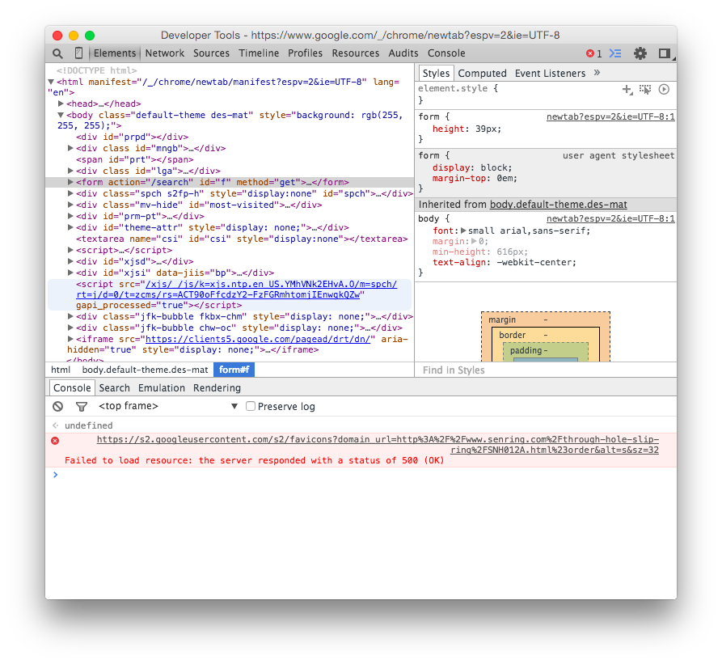

# Deep Dive 1: Mobile First and CSS

CSS3 provides powerful tools for making mobile-friendly website. The trick is that if you want to make a responsive website, you need to start with small screens in mind (or face unnecessary headaches).

Check out the code in the [example directory](./example/) and reference it as we go through this deep dive. All the sections will reference it.

## Flexbox

Flexbox is a highly powerful and versatile way to layout boxes of content that will automatically grow to fill space, wrap to new lines when they need to, and even change order based on screen size. All these things would be nightmares to do without Flexbox, but Flexbox handles them elegantly.

To use Flexbox, we put elements inside an element that we give these rules. If the element were a `<div id="container">` we would do this:

```css
#container {
  display: flex;
  flex-flow: row wrap;
}
```

`display: flex` is required for Flexbox to take effect. `flex-flow` is an optional property that specifies the direction of element flow (`row`, `row-reverse`, `column`, or `column-reverse`), and what happens to elements when they need to overflow a row or column (`nowrap`, `wrap`, or `wrap-reverse`). See the [Flexbox guide](https://css-tricks.com/snippets/css/a-guide-to-flexbox/) that is also linked at the bottom of this section for more details.

Then any element inside the container that you want to be a Flexbox could have a style like this applied:

```css
div.flexboxy {
  flex: 1 auto;
}
```

Here's how the `flex` rule actually works:

```css
div.flexboxy {
  flex: <'flex-grow'> <'flex-shrink'>? || <'flex-basis'>
}
```

The question mark means that if only one of the two first arguments (`flex-grow` and `flex-shrink`) is provided, it will be interpreted as the value for `flex-grow`. The argument `flex-basis` can optionally be (and should be) provided.

Let's define these terms:

| Term | Definition | Default |
| :--: | ---------- | :-----: |
| `flex-grow` | A value greater than `1` lets the element grow if necessary. The value represents a proportion: an element with a value of `2` will grow to twice the size of an element with a value of `1`. | `0` |
| `flex-shrink` | A value of `1` lets the element shrink if necessary. A value of `0` does not. | `1` |
| `flex-basis` | Represents the desired dimension of the element along the `flex-flow` axis. Can be an absolute or relative length, `auto`, or `0`. [This image](http://www.w3.org/TR/css3-flexbox/images/rel-vs-abs-flex.svg) explains the difference between `auto` and `0`. | `auto` |

So, for example, if we want an element to maintain a certain size no matter what, we keep it from growing or shrinking by setting both `flex-grow` and `flex-shrink` to `0`, and set its `flex-basis` to the desired size (in this case, `200px`):

```css
div.flexboxy {
  flex: 0 0 200px;
}
```

Try changing the `flex` properties in the example code and see how things respond.

### Changing element order

By default, Flexbox elements appear in the order they appear in the HTML. But we can specify this order in CSS to exercise even greater control over the layout:

```css
div.flexbody {
  ...

  order: 0;
}
```

Simply specify the order like this (increasing from `0`). The example shows this in action.

Note: to support Safari (and possibly other browsers), anything Flexbox-related needs the `-webkit-` prefix. So the above examples would have `-webkit-flex`, `-webkit-flex-flow`, `-webkit-order`, etc. instead. Chrome should support these prefixes, and the example uses them. You can use a CSS preprocessor ([Stylus](https://learnboost.github.io/stylus/) (my favorite), [Sass](http://sass-lang.com), or [Less](http://lesscss.org)) to handle prefixes (and many other things) elegantly.

This section and example code was largely inspired by [this great Flexbox guide](https://css-tricks.com/snippets/css/a-guide-to-flexbox/). A great read if you're looking for details on different ways to use Flexbox.

## CSS debugging tips

This is how I figure out if my stylesheet is being included in a new document:

```css
body {
  background-color: red; /* or some other awful CSS default color */
}
```

Simple things like making elements more visible are an immense help in debugging.

When you're doing layout, a rule like this can be useful:

```css
* {
  border: 1px dashed black;
}
```

`*` is a wildcard, so this rule gives every element a dashed black border.

### The web inspector



The web inspector is a suite of powerful, user-friendly developer tools. The constant companion of the modern web developer. The easiest way to pull it up is by right clicking any element on a webpage and selecting "Inspect Element" (or using the browser keyboard shortcut). A couple of tips:

- The Chrome web inspector can simulate mobile screens and interactions (and even adverse web conditions!). Activate this mode by clicking the button that looks like a phone in the upper-left corner (visible above).
- Right-click on any element and click "Inspect Element" to see (and edit!) the CSS styling it.
  - You can use this feature to poke around any website, especially one whose style or layout inspires you.

## Media queries

The [Mozilla media query guide](https://developer.mozilla.org/en-US/docs/Web/Guide/CSS/Media_queries), like all Mozilla web guides, is great. I encourage everyone to read it for detail on media queries.

A media query essentially allows different CSS to act based on certain qualities of the viewer's screen, like width, height, or device type. See and play with the [example code](./example/) to get a better idea, or read the guide above.