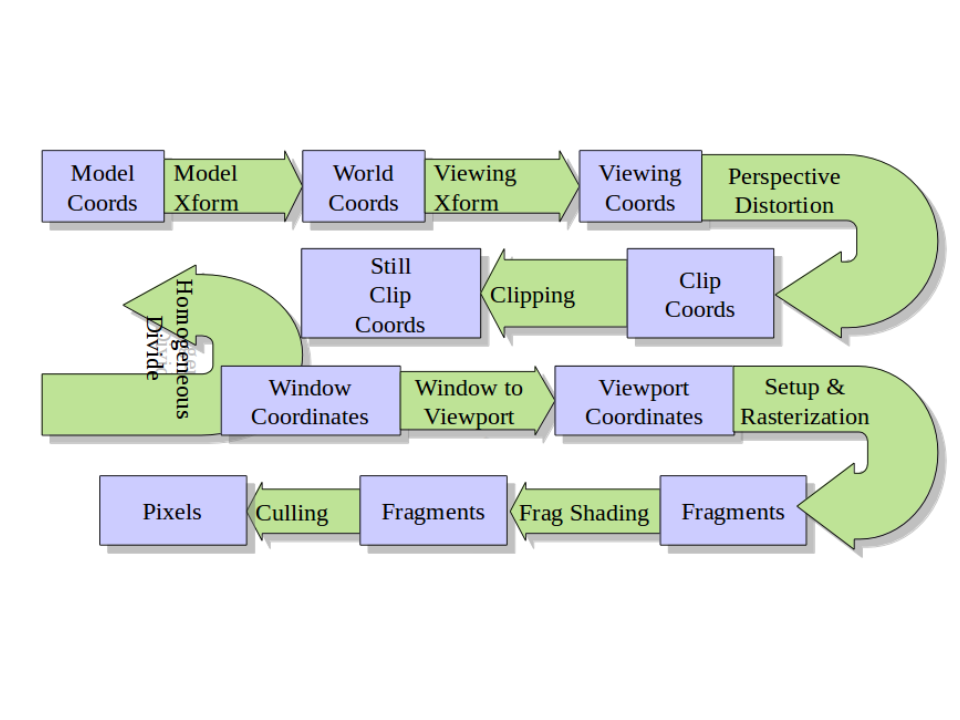

#3D Graphics in the Browser - WebGL

To see some cool examples of what you can do with WebGl look [here](https://www.chromeexperiments.com/webgl) or [here](http://madebyevan.com/webgl-water/) to see my favorite.


##Canvas and Setting Context
Before we do anything, lets talk about how to make graphics in the broswer. There are two common ways of doing so. Probably the most common is the `<svg>` tag, which when manipulated using D3 can create some powerful interfaces, but we will not talk about that in this lesson. The other method is through the `<canvas>` tag, which allows for you to programmatically create graphics through javascript. This is done by setting a context for the canvas like so:
```javascript
var canvas = document.getElementById("canvasId");
var ctx = canvas.getContext("2d");
```
Pretty simple to set up, and by changing this context string, we can set the canvas to use webgl to create more powerful graphics using our computer's graphics card. This looks like the following:
```javascript
var gl = canvas.getContext("webgl");
```
In some cases the context string will instead contain `"experimental-webgl"` because different browsers have different names for the canvas context. 

##Structure of Graphics Pipeline
While webgl gives us the ability to create cool 3D graphics, it is not a 3D library, but, for better or worse, gives us full control of the graphics pipeline instead. When people mention the graphics pipeline, this image is what they are talking about. 


##Shaders and GLSL
Shaders do most of the work. 
load
compile
attach
link
used