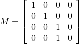

#3D Graphics in the Browser - WebGL

To see some cool examples of what you can do with WebGl look [here](https://www.chromeexperiments.com/webgl) or [here](http://madebyevan.com/webgl-water/) to see my favorite.

Note that this is a vanilla javascript lesson, as in I will not use jquery to select elements or make requests. 

##Canvas and Setting Context
Before we do anything, lets talk about how to make graphics in the broswer. There are two common ways of doing so. Probably the most common is the `<svg>` tag, which when manipulated using D3 can create some powerful interfaces, but we will not talk about that in this lesson. The other method is through the `<canvas>` tag, which allows for you to programmatically create graphics through javascript. This is done by setting a context for the canvas like so:
```javascript
var canvas = document.getElementById("canvasId");
var ctx = canvas.getContext("2d");
```
Pretty simple to set up, and by changing this context string, we can set the canvas to use webgl to create more powerful graphics using our computer's graphics card. This looks like the following:
```javascript
var gl = canvas.getContext("webgl");
```
In some cases the context string will instead contain `"experimental-webgl"` because different browsers have different names for the canvas context. 

##Structure of Graphics Pipeline
While webgl gives us the ability to create cool 3D graphics, it is not a 3D library, but, for better or worse, gives us full control of the graphics pipeline instead. When people mention the graphics pipeline, this image is what they are talking about.


Its job is to take a buffer containing the model's coordinates and convert it to colored pixels on the screen. As you can see there are a lot of steps to this, and most of them are directly controlled by code we write. Lets go through the steps quickly:  
1. The modeling transform converts the coordinate system of our model into world coordinates.  
2. The viewing transform converts the coordinate system of the world to camera coordinates.  
3. The perspective transform applies a distortion that gives the image depth.  
   The next steps are handled for us by the graphics hardware, so we do not have to worry about how the clipped perspective coordinates are transfered into fragments.  

4. Fragments are shaded or given a color vector.

The rest of the pipeline is also handled by the graphics hardware so we do not need to worry generally about how fragments' colors are interpolated. 

Based on this pipeline, you can sort of see that we are dealing with two types of information: Coordinates (vertices) and Fragments. You will soon see that we will need to write individual blocks of code or shaders to handle them. 

##Shaders and GLSL
As was previewed above, shaders are where the majority of the graphics pipeline is controlled. Shaders are written in a language called the OpenGL Shading Language(GLSL), which has a c-like syntax similar to javascript. However, has a few different parts.

###GLSL
First, like C it is staticly typed, meaning you have to specify the variable type when you declare a variable and functions must be specified either as void or the data type they return; all lines must terminate in a semicolon; void main is the entry point into the shader; arrays are static; and structures can be created to house members. However, some data types that exist in C do not exist in GLSL, and different key words are used to express the precision of a variable. An example of some syntactly correct but dull GLSL looks like this:
```
precision mediump float;

struct light{
	vec3 diffuse;
	vec3 specular;
	vec3 position;
	float shininess;
}

const highp pi = 3.14159;
void main() {
	int lambert = 1;
	bool wat = false;
	mat4 I = mat4(1.0);
}
```

Secondly, as you probably could guess from above, sort of like matlab, matrix manipulation is built into the language. However, unlike matlab, the largest a dimension can be is 4, which is large enough for all graphics purposes (If you are confused why 4 and not 3 see Appendix A's section on homogenous coordinates). This means functions like `dot()` will take the dot product of two vectors, `normalize()` will make a vector have a length of 1, and the standard `* + / -` operators do linear algebra operations. Matrix creatation tends to be a little tricky as it is done in column major order which means 
```
mat3 M = mat3(1, 0, 0,
			  1, 0, 0,
			  1, 0, 0);
```
actually creates a matrix with this form
```
[1, 1, 1,
 0, 0, 0,
 0, 0, 0]
```

Finally, it has additional key words to describe data passed to and from the shader. These are:
* `attribute` - Links vertex data from Javascript to shader.
* `uniform` - Links data that does not change across a primative from Javascript to shader. 
* `varying`  - Links data between Vertex and Fragment shader. 

And that is pretty much all you need to know to write your shaders. But, if you want more info on GLSL in a quick to digest form, [this](https://www.khronos.org/files/webgl/webgl-reference-card-1_0.pdf) reference card is good for consultation. 

###Vertex Shader
If you look back at the graphics pipeline above, you see that jobs 1, 2, and 3 are done on coordinates or vertices, so naturally the code that does these tasks is called the vertex shader. 

Here is an example of a vertex shader that takes a vertex's position and normal vector and uses them to compute `gl_Position` the perspective coordinate that is used by the GPU. 
```
precision mediump float;

attribute vec3 position;
attribute vec3 normal;

uniform mat4 model;
uniform mat4 view;
uniform mat4 projection;

void main(void) {
  gl_Position = projection*view*model*vec4(position,1);;
}
```
And that's it. However, if we want to render things with lighting and color we generally will need to add some additional calculations to our vertex shader. If we want to impliment the Blinn-Phong lighting model, a relative good-looking photo realisic lighting model, we would replace `void main()` with the following to our vertex shader: 
```
uniform mat4 inverseModel;
uniform mat4 inverseView;
uniform mat4 inverseProjection;

uniform vec3 lightPosition;

varying vec3 lightDirection;
varying vec3 viewNormal;
varying vec3 eyeDirection;

void main(void) {
  vec4 viewPos = view*model*vec4(position, 1);
  vec4 surfPos = projection*viewPos;
  gl_Position = surfPos;

  eyeDirection = normalize(viewPos.xyz);
  lightDirection = normalize((view*vec4(lightPosition,1.0)).xyz - (viewPosition).xyz);
  viewNormal = normalize((vec4(normal, 0.0) * inverseModel * inverseView).xyz);
}
```
The `.x .xy` allow for selecting and rearanging of vector components without using array numeric syntax. This makes more sense as it is more representative of what the vector represents. {r, g, b, a}, {s, t, p, q}, compliment {x,y,z,w} but are generally used to select color vectors and texture vectors respectively. This is known as swizzling. 

The varying vecs will be passed to the fragment shader, which will then use them to compute the actual blinn-phong lighting. 

###Fragment Shader
Looking back to the pipeline again, number 4 is all that is left for the fragment shader to complete. This means the fragment shader is responsible for computing the lighting or coloring of the fragment. An extremely basic shader just assigns a constant color vector to the `gl_FragColor` which is used by the graphics hardware to determine the color of the pixels on the screen.
```
precision mediump float;

void main(void) {
	gl_FragColor = vec4(1, 1, 1, 1);
}
```
Here is what that looks like.


However, if we were to complete our blinn-phong model from before our shader would look something like this:
```
precision mediump float;

uniform mat4 model;
uniform mat4 view;
uniform mat4 projection;

uniform mat4 inverseModel;
uniform mat4 inverseView;
uniform mat4 inverseProjection;

uniform vec3 ambient;
uniform vec3 diffuse;
uniform vec3 specular;

uniform vec3 lightPosition;

uniform float shininess;

varying vec3 lightDirection;
varying vec3 viewNormal;
varying vec3 eyeDirection;

void main(void) {
	float lambert = max(dot(viewNormal, lightDirection),0.0);
	float phong = pow(max(dot(reflect(lightDirection, viewNormal), eyeDirection), 0.0), shininess);

	vec3 light = (ambient+diffuse*lambert+specular*phong);
	gl_FragColor = vec4(light, 1);
}
```
Much more complicated, but this is the result.


And there you have it, a much better looking object. If you would like a more in-depth tutorial on shading, [this](https://github.com/stackgl/shader-school) tutorial from nodeschool is really good. 

NOTE: functions written in the shader are not designed to run for a long time. Shaders are good for doing a small set of things repeatedly for a huge number of times. This means that looping is also strictly controlled, so be aware of that. 

##WebGl...Finally 
Now that we know how to write shaders, which handle most of the graphics pipeline, how do we incorporate them into our app? This turns out to be much more difficult that just writing shaders. 

The first step to incorporating our shaders is to get the shader source code as a string to the client. There are two ways of doing this: make a request, read from DOM. I am going to assume you understand how to do the first method, and instead talk about the second one. 

To load a shader from the DOM, we can use a script tag to house our shader code. This looks like this:
```html
<script id="shader-vs" type="x-shader/x-vertex">
	attribute vec4 aVertexColor;
	attribute vec3 aVertexPosition;
	uniform mat4 MVMatrix;
    uniform mat4 PMatrix;

	varying vec4 vColor;

	void main(void) {
	    gl_Position = PMatrix*MVMatrix*vec4(aVertexPosition, 1.0);
	    vColor = aVertexColor;
	}
</script>
	  
<script id="shader-fs" type="x-shader/x-fragment">
	precision mediump float;
	varying vec4 vColor;
	void main(void) {
	    gl_FragColor = vColor;
	}
</script>
```
We can then select each shader using its id. However, this just gives use the element, so we need some way of selecting the text between a script tag. This is easily done using `elem.innerHTML` if we have nothing else in our script tag. However, you may also use `elem.firstChild.textContent` or just `elem.text`. So our javascript so far looks something like this:
```javascript
function loadShaderFromDOM(gl, id) {
	var shaderScript = document.getElementById(id);

	if (!shaderScript) {
		return null;
	}

	var child = shaderScript.firstChild;
	if (child.nodeType != 3) {
		return null;
	}

	var shaderSource = child.textContent;
	var shader;

	if (shaderScript.type == "x-shader/x-fragment") {
		shader = gl.createShader(gl.FRAGMENT_SHADER);
	} else if (shaderScript.type == "x-shader/x-vertex") {
		shader = gl.createShader(gl.VERTEX_SHADER);
	} else {
		return null;
	}

	gl.shaderSource(shader, shaderSource);
	gl.compileShader(shader);

	if (!gl.getShaderParameter(shader, gl.COMPILE_STATUS)) {
		alert(gl.getShaderInfoLog(shader));
		return null;
	} 
	return shader;
}

``` 
Good thing this is reuseable, as we will need something like this on every webgl app we make. The keys to creating the shader are the lines `target = gl.createShader(ENUM)`, `gl.shaderSource(target, sourceString)`, and `gl.compileShader(target)`. If you need a refresher, `gl` is the context of the canvas element from the very first section of the lesson. The method of the context `createShader` creates a shader object from an enum (read: a c data-type that is just an expressive name for a specific numeric value), which have the form `gl.SOMETHING_IN_CAPS`. The new shader object is passed into the method `shaderSource` followed by a string representing the shader. The shader object with its new shader source is then compiled usign the method `compileShader`. Errors with this method unfortunately are not easily accessed which is why the methods `getShaderParameter` and `getShaderInfoLog` are used above. 

So now that we have a compiled shader object, we still need to attach it our app so it can be used. This is done through the creation of a "program"; shaders are attached to this "program," which is then used by the app. Theoretically we could have multiple programs with different shaders attached to them if we wanted to render some objects differently from others, and the code to accomplish that would be similar. So, lets make a function that creates a program and attaches our shaders.
```javascript
function createProgram(gl, vs, fs) {
	if (!gl || !vs || !fs) {
		return null;
	}

	var prog = gl.createProgram();
	gl.attachShader(prog, vs);
	gl.attachShader(prog, fs);
	gl.linkProgram(prog);

	if (!gl.getProgramParameter(prog, gl.LINK_STATUS)) {
		alert("failed to setup shaders");
		return null;
	}
	return prog;
}
```
Cool. So now we have a program linked with our shaders attached. All we have left to do is call `gl.useProgram(programObj)` and we are all set to start specifying the values of the uniforms and attributes in our shaders. 

##Actually Drawing Something
Finally, we have most of the webgl overhead out of the way, so we can now actually work on putting objects on the screen. Well, after we tell gl where the attributes and uniforms live plus where the buffers that fill them with information go. 

So lets make a javascript function to do this. From our shader program, we need to set up the following:
* attribute vec4 aVertexColor;
* attribute vec3 aVertexPosition;
* uniform mat4 MVMatrix;
* uniform mat4 PMatrix;

Given a program with the name `programObj` our code looks like this:
```javascript
var programObj = createProgram(gl, vShader, fShader);

var vPositionAttrLoc = gl.getAttribLocation(programObj, "aVertexPosition");
var vColorAttrLoc = gl.getAttribLocation(programObj, "aVertexColor");

var mvMatrixUniLoc = gl.getUniformLocation(programObj, "MVMatrix");
var pMatrixUniLoc = gl.getUniformLocation(programObj, "PMatrix");

gl.useProgram(programObj);
```
These attribute and uniform locations will be used to tell gl what to send to the shaders. But first, we need to set up the structures to hold the data. For the attributes, gl uses a buffer (read: typed array) to house data. Whereas for the uniforms, gl is less strict. So for our program, we need to create and specify what buffers belong to each attribute. 
```javascript
var vPositionBuffer = gl.createBuffer();
gl.bindBuffer(gl.ARRAY_BUFFER, vPositionBuffer);
gl.enableVertexAttribArray(vPositionAttrLoc);
gl.vertexAttribPointer(vPositionAttrLoc, 3, gl.FLOAT, false, 0, 0);

var vColorBuffer = gl.createBuffer();
gl.bindBuffer(gl.ARRAY_BUFFER, vColorBuffer);  
gl.enableVertexAttribArray(vColorAttrLoc);
gl.vertexAttribPointer(vColorAttrLoc, 4, gl.FLOAT, false, 0, 0);
```
Let's walk through these lines, as they are important. The method `createBuffer` creates a gl buffer object and assigns it to a varriable. Binding the buffer tells gl the next commands will be done on this buffer. In this case, we are attaching the attribute to the buffer, so we need to enable the attribute by passing in its location, then describe how gl will move through the attached buffer. To describe how gl moves through the attached buffer, we use the method `vertexAttribPointer` which has the form 

```
gl.vertexAttribPointer(
    location,
    numComponents,
    typeOfData,
    normalizeFlag,
    strideToNextPieceOfData,
    offsetIntoBuffer);
```
Because our position attribute was a `vec3`, we set the second input to 3; we are dealing with floats so type of data is `gl.FLOAT`; there is no normalization, and we are not reusing this buffer for multiple attributes, so the last arguments are `false, 0, 0`.   

So now our attributes have buffers attached to them. All we need to do now is fill them with data, set up our uniforms and call draw and stuff should appear on the screen. 
```javascript
gl.bindBuffer(gl.ARRAY_BUFFER, vPositionBuffer);
gl.bufferData(gl.ARRAY_BUFFER, new Float32Array([
									0.0, 1.0, 0.0,
									1.0, -1.0, 0.0,
									-1.0, -1.0, 0.0]), 
								gl.STATIC_DRAW);

gl.bindBuffer(gl.ARRAY_BUFFER, vColorBuffer);
gl.bufferData(gl.ARRAY_BUFFER, new Float32Array([
									1.0, 0.0, 0.0, 1.0,
									0.0, 1.0, 0.0, 1.0,
									0.0, 0.0, 1.0, 1.0]),
								gl.STATIC_DRAW);

var mvMat = mat4.create();
var pMat = mat4.create();

gl.uniformMatrix4fv(mvMatrixUniLoc, false, mvMat);
gl.uniformMatrix4fv(pMatrixUniLoc, false, pMat);

gl.drawArrays(gl.TRIANGLES, 0, 3);
``` 
Now we should see a triangle take up most of the canvas with different color vertices interpolated across the triangle. The `bufferData` method fills the last bound buffer with data. We have to use a javascript typed array which is why `new Float32Array(arr)` is used. We needed to rebind the buffers to fill them as the last bound buffer was the color buffer, and I wanted to put the position code before the color. The `mat4.create()` uses a library included in this lesson called gl-matrix to create an 4x4 identity matrix. The library allows for matrix manipulation in javascript, so is very useful.
Finally we set our uniforms and call draw. There are many different functions to set uniforms. The one we used sets a 4x4 matrix of floats from an array, and in general the name of the method reflects the data it creates. The `drawArrays` method tells gl how it should draw the values in the buffer, where to start in the buffer, and how many times it should move the pointer. Gl can draw the values in the buffer in a few different ways. Most of the time `gl.TRIANGLES` will be what you want. However, if you want to learn more about different drawing see Appendix B. 

#Appendix A: Mathematical Concepts

##Transformations 
If we want to draw a model on the screen, we apply to the model a series of transformations. We take the points that make up the model, translate and scale them to place them in the world; we then apply a rotation to turn the camera towards the model, and finally we project the model into the viewing plane to display it on the screen. This example highlights the five major transformations that are common in graphics: rotation, reflection, scaling, projection, and translation. These are some of the set of transformations known as affline transformations, and we respresent them in the form y = Mx+b where y is the reslutant point, M is a matrix representing a linear transformation, x is the intial point, and b is a vector. The difference between a linear transformation and an affline transformation is that a linear transformation must preserve the zero point while an affline transformation does not. 

Linear tranformations can be represented by a square matrix of the size of the space. For example, if we choose to describe a point with a 2x1 vector, we can represent a rotation about the origin with the matrix: 


We can compose multiple linear transformations by multiplying the matrices representing the transform together. For example if we have a rotation matrix R and a sacling matrix S we can rotate then scale a point x with the equation y = SRx. However, because of our choice to represent a point as a 2x1 vector, we cannot represent a translation with a matrix, and so we cannot compose multiple transformations together using just matrix multiplication if translation is one of those transformations.

##Homogenous Coordinates
The solution to being unable to compose translation by matrix multiplication can be solved by using homogenous coordinates to represent points and vectors. Homogenous coordinates are simply the addition of another dimension to the space. For example, our two dimensional point (x,y) would be represented by a three dimensional point (x,y,1). This third dimension should not be thought of as a z coordinate but rather a weight that is zero to denote a vector and 1 to denote a point. This applies to higher dimensions also. 3d homogenous coordinates have four dimensions, which is why glsl uses {x, y, z, w} as a notation for component swizzling.  

##Transformations in Homogenous Coordinate Systems
We should then rewrite the example rotation matrix to work with our new coordinates. This would look like:


And in fact any linear transformation in the previous coordinate system can be converted to homogenous coordinates by padding the original matrix representing the transform as in the example above. However, we can now represent translation as matrix multiplication. 


This implies that any affline translation in our previous coordinate system is now a linear transform in our homogenous coordinate system. We can also see that the two transformation examples above do not affect the weight coordinate, which is true for most transformations. We can actually take advantage of the weight coordinate when we to a projection. For example, if we want to squish our world onto a viewing plane centered at the origin and z coordinate of 1, we want to divide the x coordinate and y coordinate by the z coordinate. We can then use the following transformation matrix to accomplish this. 



All this transformation actually does is set the value of the weight coordinate equal to the value of the z coordinate, but when a point has a weight greater than one, it indicates to the hardware that it is further away from the projection plane. The hardware will then run a "homogenous divide" after the vertex shader runs. This divides the x, y, and z coordinates of each point by each point's weight coordinate, accomplishing the example projection.  

#Appendix B: Drawing in GL

There are 7 different drawing modes in GL: POINTS, LINE_STRIP, LINE_LOOP, LINES, TRIANGLE_STRIP, TRIANGLE_FAN, TRIANGLES. In the examples, TRIANGLES is always used. The TRIANGLES mode will take every three vertices in the buffer (or the number of components specified multiplied by 3 floats) and pass those to the respective attribute. Thus, when using TRIANGLES, we need to specify every vertex belonging to the triangle. POINTS behaves similarly except that POINTS draws every vertex on the screen instead of three vertices. LINE_STRIP draws a line between the current vertex and the next vertex in the buffer, and LINE_LOOP does the same but will connect the last vertex with the first vertex in the buffer. TRIANLE_STRIP works similarly to LINE_STRIP in that every additional vertex is drawn in a trangle with the previous two vertices. Finally, TRIANGLE_FAN starts with the first vertex, and from then on draws a triangle between this vertex, the current vertex and the previous vertex. So given a buffer with `[-.2, .6, -.6, .6, -.6, 1., .6, 1.]` we would get two triangle with the vertices (-.2, .6), (-.6, .6), (-.6, 1.) and another with the vertices (-.2, .6), (-.6, 1.), (.6, 1.). 