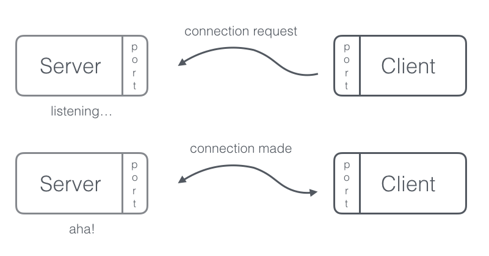

Two-way network communication - Sockets
============================

> Cool examples exist everywhere, from [Messenger](https://wwww.messenger.com) to interactive WebGL games that use WebSockets for their controls, as shown [here](http://www.websocket.org/demos/racer/index.html).

# Definition 
A socket is one endpoint of a two-way communication link between two programs running on the network. A socket is bound to a port number so that the TCP/HTTP layer can identify the application that data is destined to be sent to. 

We have learned so far that a server runs on a machine at a specific port. A port is an address for a particular program or process on a server. A socket is a wrapper for a port: it provides a programming interface which lets programs use the port for communication Schematically, we can vizualize this as shown below. 



Let's look what this figure above is telling us in more detail. The "client" knows the hostname of the machine on which the server is running and the port on which the server is listening to - in our case, localhost:3000. In order to make a connection request, the client needs to identify itself to the server, therefore, it binds to a local port number that it will use during this connection. On the server-side now, if everything worked fine, the server accepts the connection request and it gets a new socket bound to the same local port. It needs a **new** socket so that it continues to listen to any existing socket connection requests, while serving the requests from the already-connected client.


# Socket.IO
Now that we know how sockets work, it's time to introduce the library we are going to use in this deepdive. [SocketIO](http://socket.io/) is a JS library that enables realtime, bi-directional communication between web clients and servers. The interesting thing about SocketIO is that it actually consists of two parts; a client-side library and a server-side library. The even cooler thing is that the APIs are almost identical. In order to understand how sockets work we are going to create a simple chat app that demonstrates the main ideas of this topic! Feel free to explore additional cool features once this tutorial is complete.

# Let's get started 
### File Structure
Go ahead and create an new directory `Socket-chat` that has the following file structure.

	  .
    ├── app.js                          # API script
    ├── package.json                    
    ├── public/                         # Public files (layout, styles and JS scripts)
    │   ├── main.html                   
    │   ├── styles/
		│   └── main.css                
    │   └── javascripts/  
    │	    └── main.js                 
    .

### Dependencies
Populate your `package.json` with the following block

```javascript
{
  "name": "Socket-Chat-OlinJS-deepDive",
  "version": "0.0.1",
  "main":"app.js",
  "description": "It's going to be a sick chat app",
  "dependencies": {}
}
``` 

We are going to use two main frameworks for this app: `express` and `socket.io`. Go ahead and install them under your working directory by typing in your console `npm install --save express` and `npm install --save socket.io` to get them, respectively. Your `package.json` should now look something like this:

```javascript
{
  "name": "Socket-Chat-OlinJS-deepDive",
  "version": "0.0.1",
  "description": "It's going to be a sick chat app",
  "main": "app.js",
  "dependencies": {
    "express": "^4.10.2",
    "socket.io": "^1.4.5"
  }
}
```
### Files
Let's write some code to populate certain files pertaining to the frontend of our application. Paste the following piece of code in your `index.html`. We are simply linking a stylesheet, a js script and initializing a `<ul>` field for the future messages of our app and a `<form>` that will handle the typing and submission of the chat message.

```html
<!doctype html>
<html>
  <head>
    <title>Socket-Chat-OlinJS-deepDive</title>
    <link rel="stylesheet" type="text/css" href="/styles/main.css">
  </head>
  <body>
    <ul id="messages"></ul>
    <form action="">
      <input id="m" autocomplete="off" />
      <button>Send</button>
    </form>
    <script src="https://cdn.socket.io/socket.io-1.4.5.js"></script>
    <script src="http://code.jquery.com/jquery-1.11.1.js"></script>
    <script src="/javascripts/main.js"></script>
  </body>
</html>
```

You can style your app as you please, but for now you can simply paste this code in your `main.css` file that will give some beauty to your app.

```css
* { 
	margin: 0; 
	padding: 0; 
	box-sizing: 
	border-box; 
}

body { font: 13px Helvetica, Arial; }
form { background: #000; padding: 3px; position: fixed; bottom: 0; width: 100%; }
form input { border: 0; padding: 10px; width: 90%; margin-right: .5%; }
form button { width: 9%; background: rgb(130, 224, 255); border: none; padding: 10px; }
#messages { list-style-type: none; margin: 0; padding: 0; }
#messages li { padding: 5px 10px; }
#messages li:nth-child(odd) { background: #eee; }

```
Now we can place some boilerplate code in `app.js` that we will analyze thoroughly. 

```javascript
var express = require('express');
var app = express();

var http = require('http').Server(app);
var io = require('socket.io')(http);
var path = require('path');

app.use(express.static(path.join(__dirname, 'public')));

app.get('/', function(req, res){
  res.sendFile(__dirname + '/public/main.html');
});

io.on('connection', function(socket){
  socket.on('chat message', function(msg){
    io.emit('chat message', msg);
  });
});

var PORT = process.env.PORT || 3000;

http.listen(PORT, function() {
  console.log("Application running on port:", PORT);
});

```
We know that express initializes `app` to be a function handler that we can supply to an HTTP server. In addition to that we initialize a new instance of socket.io in line 5, by passing it the http object. We then wait for incoming sockets to signal connection events and we log each one int he console.

Our API structure is pretty simple. We are handling the "/" path with a simple render of the page via sending `main.html`. Although we are going to analyze this in the upcoming section, the `io.on(...)` block handles the emitting and broadcasting of the messages using sockets. Finally, as always we specify the port we are running at, which may be set as an environment variable.

Now go ahead and add the following piece of code in `main.js`

```javascript
var socket = io();
  $('form').submit(function(){
    socket.emit('chat message', $('#m').val());
    $('#m').val('');
    return false;
  });
```

There are several points to highlight here. Essentially, with the first line we are able to load the `socket.io-client`. Notice that we are not specifying an input to *io*, as by default it will try to connect to the host that serves the page. The next few lines handle the "submit" event form the form available in the view. We will emit the chat message of given value over to the server-side via the socket established. 

# Emitting and Broadcasting events
With socket-io we can pass back and forth any form of data, if it can be encoded as JSON. Using the *emit* method, we are able to send the message to the pending socket waiting for a request from the client on the server-side. Our goal now is to send/emit the event back to the client from the server. This is also known as *broadcasting*. To do so, we simply replace the portion of code that was handling socket-io in `app.js` with the following:

```javascript
io.on('connection', function(socket){
  socket.on('chat message', function(msg){
    io.emit('chat message', msg);
  });
});
```
By typing the code above, we send the message back to "everyone", including the sender. When we capture a chat message event on the client-side we’ll include it in the page, this is done by the following code:

```javascript
socket.on('chat message', function(msg){
  $('#messages').append($('<li>').text(msg));
});
```

Hence, the total client-side JavaScript code now amounts to:

```javascript
var socket = io();
$('form').submit(function(){
  socket.emit('chat message', $('#m').val());
  $('#m').val('');
  return false;
});
socket.on('chat message', function(msg){
  $('#messages').append($('<li>').text(msg));
});
```

Aaaand your app should now be done. If you open localhost:3000 in two different tabs you will see that you may send messages and asynchronously both parties view the updated list of messages that take place between them. Please make sure that you look under the folder `example` in this repository that contains the code alluded to in this README.

There are many resources out there for one to further explore the area of sockets. This README mainly serves as a sample tutorial of what you can do with socket-io, by extracting a lot of content from their website and other resources online. If you want to make interactive playlist applications or interfaces that multiple people at the same time can access and edit (simple collaborative Paint app or google doc equivalent), sockets is for you! :)
