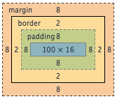
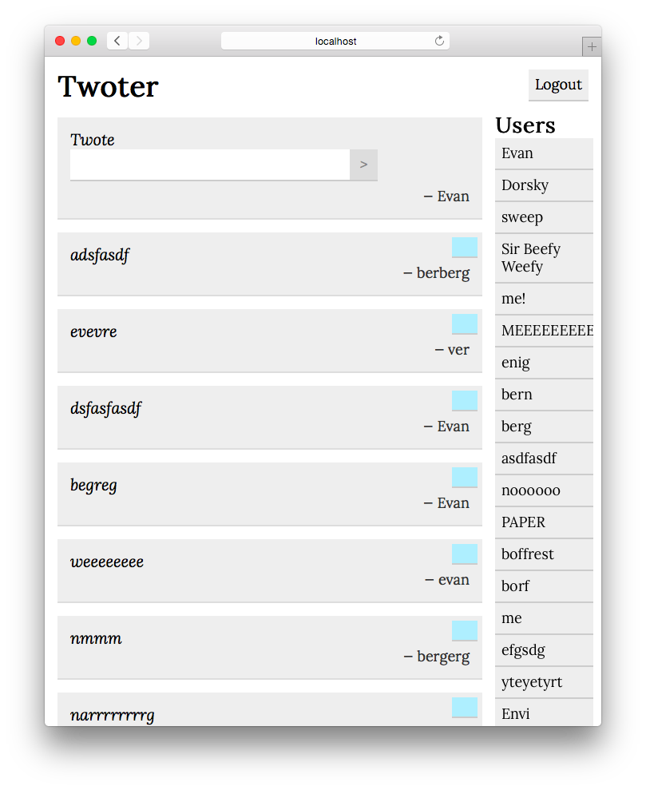

## Table of Contents
<!-- MarkdownTOC -->

- [Lesson 6 - CSS and Development Style](#lesson-6---css-and-development-style)
  - [Quick Review](#quick-review)
  - [Error Handling](#error-handling)
  - [Debugging](#debugging)
  - [Modularity](#modularity)
  - [CSS](#css)
  - [Sass](#sass)
  - [CSS Frameworks](#css-frameworks)
  - [Design](#design)
- [Lesson 6 In-Class Exercises](#lesson-6-in-class-exercises)
- [Before Class 7 \(Friday 2/10/17\)](#before-class-7-friday-21017)

<!-- /MarkdownTOC -->

# Lesson 6 - CSS and Development Style

In this lesson we're going to cover some big ideas that span front-end and back-end development (and life!), and also round out our front-end knowledge by learning about CSS.

## Goals


## Quick Review

### Separation of Concerns

- **HTML** specifies the _structure_ and _content_ of a webpage.
- **CSS** specifies the _presentation_ or _appearance_ of elements on a webpage.
- **JavaScript** (in the front-end) lets the developer create _interactive_ elements.
It's how the client communicates with the server and the user.

Before CSS, HTML was also used to control the appearance of webpages.
This is why websites from the '90s look terrible.

These three technologies embody the principle of _separation of concerns_ — they are each completely responsible for a single aspect of a complex web app.

### App file structure/hierarchy

Most of you have been using a folder structure like the one below.
Let's just briefly formalize it:

- **/models** - contains ORM (object-relational mapping) models (mongoose `Schemas`) for our database (MongoDB)
- **/views** - view templates
- **/public** - all static content
	- **/images**
	- **/stylesheets** - all CSS
	- **/javascripts** - client-side javascript
- **/routes** - all express routes, separated by app module/area
- **/tests** - for unit-tests (we'll talk about tests later)
- **/node_modules** - created by `npm`

There's room for variation in the organization of your static content (you may see an **assets** folder containing **images** and other folders if you have many different types of assets) but the other folders are fairly standard, and good for a variety of reasons.

### jQuery and `this`

A brief word on jQuery and the JavaScript variable `this`:

Every JavaScript function is implicitly passed an argument called `this`.
The variable `this` is a way of passing a function call a context.

One great application of this is accessing the element that fired a jQuery event.
Here's a common case: I want to bind a `click` event to all elements with a class `my-class`, but I want to perform an action specific to the specific element that is clicked. If I bind the event like this:

```node
$('.my-class').click(clickHandler);
```

Then simply doing this in my click handler:

```node
function clickHandler() {
	var $clicked = $('.my-class');
	// do things with $clicked
}
```

Won't do. The selection `$('.my-class')` will always return an array containing every single element in the entire document with the class `my-class`. However, jQuery solves this problem elegantly:

**Every jQuery event handler is passed the element that fired the event as `this`.**

In the example above, `clickHandler` is our event handler. When an element with `my-class` is clicked, jQuery handles the event by calling `clickHandler` and passing the clicked element to the function as `this`. So we can do this:

```node
function clickHandler() {
	var $clicked = $(this); // wrap it in a jQuery selector
	// do things with $clicked
}
```

This is how we operate on the element that was clicked.

## Error Handling

By now you've probably seen a lot of errors in your console.
Handling errors well is key to writing robust Node apps.

### Operational vs. Programmer

**Operational errors** are problems that the user can experience while running your program that are not caused by errors with your program's code.
The user's system could be out of memory, or the user could supply invalid input.

**Programmer errors** are bugs in the program code that can be resolved by fixing the code.

Even correct programs cannot avoid all operation errors, so they must handle them correctly.
It's up to the programmer both to avoid programmer errors (by writing good code and debugging effectively — we'll cover this later), and to _handle_ operational errors as gracefully as possible.

### Asynchronous Error Handling

The standard method signature for a Node callback is this:

```node
function(err, result) {
    ...
}
```

If there was no error, `err` is `null` and `result` is not.
Otherwise, `err` is _not_ `null` and result is.
This is about the simplest way to handle errors:

```node
function(err, result) {
    if (err)
        return console.error(err);
    ...
}
```

We can do much more sophisticated things, from attempting to recover from the error to simply informing the user of the error (`console.error` prints to the server console, so the client is never informed).

Most of our functions are asynchronous (callbacks), so this is a very common way to handle errors in Node.
We may cover other ways to handle errors in future classes or deep dives.

### Response Status

As we touched on in class 1, there are [many HTTP status codes](http://en.wikipedia.org/wiki/List_of_HTTP_status_codes).
Express makes it easy to set the status of a response.
You can simply chain a call to `status` in your response, like this:

```node
res.status(404).render('error_404', { data })
...
res.status(500).json({ error: 'message' })
```

Whenever possible, you should set the appropriate response status in this way.

#### Joyent has great documentation on error handling in Node [here](https://www.joyent.com/developers/node/design/errors).

## Debugging

Learning how to debug is one of the most important things you can get out of learning to program.
It's a skill you'll use everywhere, every day.
You already do.

### Know your entire system

Effectively debugging a system means debugging it in context.
Your Node webserver runs from your UNIX terminal running on a distribution of Linux, on a computer connected to the internet through a wireless router or ethernet connection.
To debug effectively, you have to acknowledge that any part of your system could break and cause problems.

### Read error messages and stack traces

Error messages are not bad.
They exist to help you! Without them, you would have no indication of where to start when something went wrong — your app would just crash.

So you should always read them.
Focus on the parts of the error message that you understand.

#### _Google error messages!_

#### Stack Traces

When an error means that the app can no longer function consistently, it should be "thrown". A thrown error produces an exception, and an uncaught exception will crash the app. Whenever your server crashes from an exception, you get a stack trace. The stack trace is kind of like a snapshot of the memory the program was using when and where it crashed — it shows the tree of functions containing the function that caused the crash. If the error was a simple syntactical one, Node might point it right out for you:

```bash
/Users/Enigmoid/Git/olinjs/classes/class06/sessions/app.js:26
        req.session.counter++;
        ^^^
SyntaxError: Unexpected identifier
    at Module._compile (module.js:439:25)
    at Object.Module._extensions..js (module.js:474:10)
    at Module.load (module.js:356:32)
    at Function.Module._load (module.js:312:12)
    at Function.Module.runMain (module.js:497:10)
    at startup (node.js:119:16)
    at node.js:929:3
```

In this case, we should clearly inspect around line 26 of `app.js`.
I say around because it's common for the offending line to come _before_ the identified line, but rarely after.
Syntax errors are usually caught when modules are "compiled" by Node for external use.

Here's another stack trace from a slightly sneakier error:

```bash
TypeError: Cannot set property 'count' of undefined
    at /Users/Enigmoid/Git/olinjs/classes/class06/sessions/app.js:25:26
    at Layer.handle [as handle_request] (/Users/Enigmoid/Git/olinjs/classes/class06/sessions/node_modules/express/lib/router/layer.js:82:5)
    at next (/Users/Enigmoid/Git/olinjs/classes/class06/sessions/node_modules/express/lib/router/route.js:110:13)
    at Route.dispatch (/Users/Enigmoid/Git/olinjs/classes/class06/sessions/node_modules/express/lib/router/route.js:91:3)
    at Layer.handle [as handle_request] (/Users/Enigmoid/Git/olinjs/classes/class06/sessions/node_modules/express/lib/router/layer.js:82:5)
    at /Users/Enigmoid/Git/olinjs/classes/class06/sessions/node_modules/express/lib/router/index.js:267:22
    at Function.proto.process_params (/Users/Enigmoid/Git/olinjs/classes/class06/sessions/node_modules/express/lib/router/index.js:321:12)
    at next (/Users/Enigmoid/Git/olinjs/classes/class06/sessions/node_modules/express/lib/router/index.js:261:10)
    at Object.<anonymous> (/Users/Enigmoid/Git/olinjs/classes/class06/sessions/node_modules/express-session/index.js:421:7)
    at Object.immediate._onImmediate (timers.js:372:16)
```

At some point, you'll probably encounter an error message which mentions `undefined`, like `undefined is not a [function|object]`.
The broken code (which should be your code) is usually at the top of the stack trace — here we can see that it is still in `app.js`, this time on line 25. The offending line tried to set a property of an undefined property on the `req.cookies` object.

Stack traces are useful to find what line of code caused the app to crash. Depending on the error, this line could be all the information you need, or could be relatively useless. But the computer is always following a set of unbreakable rules, so no information should be completely discounted when bugging.

### Remember that someone else has done this before

Someone else has already found your error and asked about it on the internet — this is why Googling your error messages is so helpful.
You'll often find an answered StackOverflow question.
This is the best place to start — error messages are designed to be helpful, but they only contain so much information on their own.

### Know your tools

#### The Server Console

Calls by your Node server to `console.log`, error messages, exceptions, and stack traces go to the server console.
When you deploy to Heroku, you can access your server console output with `heroku logs`.

#### The Browser Console

When you write and debug front-end JavaScript, all `console.log` calls, error messages, exceptions, and stack traces go to the console in your browser, accessible through the web inspector.

It's easy to go very far down a debugging path only to realize that it was the wrong path.
One of the most difficult things about debugging is deciding where to start.

### Know that you have full control

The computer doesn't know what you mean, just what you say.
Programming is an exercise of boiling down your understanding of a problem to something a machine can understand.
The computer does exactly what you tell it to do, 100% of the time.

_All the time._

This means that no matter what, something you did is always responsible for the behavior of your program.
In one sense, every error is your fault.
But more importantly, _you always have complete control_.
If you can break your program, you can make it run.

_Starting with something that works_ and _making incremental changes_ are the two best ways to maintain an understanding of how the code you write controls the behavior of your program.

**Git** is a fantastic enabler in this endeavor!

## Modularity

A simple way to keep your code modular and use namespaces to prevent overwriting variable names is through this structure:

```node
var yourNamespace = {

    foo: function() {
    },

    bar: function() {
    }
};
...

yourNamespace.foo();
```

Read [this article on a similar design called the module pattern](https://toddmotto.com/mastering-the-module-pattern)

Additionally, you can modularize your code by looking at [naming conventions like BEM](https://css-tricks.com/bem-101/), which is a generally accepted way to keep your CSS classes readable and easily usable.

Another nice way to organize code is to use helper libraries like [**lodash**](https://lodash.com/) or [**underscore**](http://underscorejs.org/).  [This article does a comparison of the two](http://benmccormick.org/2014/11/12/underscore-vs-lodash/) and ends up recommending lodash.  The two have very similar functionalities and syntax.

Install lodash through:
```bash
$ {sudo -H} npm i -g npm
$ npm i --save lodash
```

and then use it in Node: ```var _ = require('lodash');```

Read through the [lodash docs](https://lodash.com/docs) (or check out their [searchable interface](http://devdocs.io/lodash-array/)) to get an idea of some of the useful helper functions

## CSS

Open up [Codepen](http://codepen.io/pen/), we're going to learn CSS!

CSS (cascading style sheets) is the language that makes the web pretty.
It lets us describe the **look and formatting** of HTML elements.
In this way, it *separates the concern* of the style of the page from all other aspects of a web app.
In the early days of the web, HTML was also responsible for this, but all HTML formatting and style directives are now deprecated in favor of CSS.

Every HTML element can be styled by CSS.
Elements can be styled by tag name, class, id, and more.
Below is an example of basic CSS syntax:

```css
selector {
	property: value;
	property: value;
	...
}
```

Properties can be named in any order, but in the case of directly conflicting properties, the last one defined will apply.
Many property names are fairly self-explanatory, but the [full property table](http://www.w3.org/TR/CSS21/propidx.html) may serve as a useful reference.
Or Google.

### Units

Many properties values are lengths, which can be specified in many different ways in CSS.
The units below are the most common.

| Unit	| Description |
|----|----|
| `px` | Usually a single pixel on the client's screen (a line of width `1px` is guaranteed to be "sharp and visible")
| `em` | Relative to the font-size of the element (`0.5em` is half of the current font-size)
| `rem` | Relative to the font-size of the `<html>` or "root" element (`0.5em` is half of the root font-size)
| `%` | Percent of the parent element along the relevant dimension (horizontally or vertically)
| `vh` | (New in CSS3) 1/100th of the viewport height
| `vw` | (New in CSS3) 1/100th of the viewport width

CSS also supports the absolute units `cm`, `mm`, `in`, `pt`, and `pc`, but these are better suited for print than the screen.

### Selectors and Specificity

The most common selector is a `tagname`, a `class` (preceded by `.`), or an `id` (preceded by `#`), though there are many other ways to select elements to style.

Styles of elements _cascade_ (apply) to their child elements.
In cases where multiple conflicting styles are applied to an element, _the more specific style prevails_.

So with this document:

```css
<div class="styled">Content</div>
```

and this style:

```css
div {
	color white;
	background-color: red;
}

.styled {
	background-color: blue;
}
```

The single `div` in the document will have a blue background color because the selector `.styled` is more specific than `div`.
Paste the above into [Codepen](http://codepen.io/pen/) to test it out.

### Colors

A quick aside on colors, which can be specified in CSS in multiple ways.

| Method | Description |
|----|----
| `#RRGGBB` | Red, green, and blue are each specified by a two-digit hex number, `00` to `FF`. White is `#FFFFFF` and black is `#000000`.
| `#RGB` | Same as above but with half the precision.
| `name` | Certain colors (like red, blue, yellow, etc.) can be specified simply by name. They're mostly hideous but black and white are fine.
| `rgb(r,g,b)` | Red, green, and blue are specified on a 0-255 scale.
| `rgba(r,g,b,a)` | Same as above, but alpha (opacity) is specified on a 0-1 scale.

Here's a neat [clock](http://whatcolourisit.scn9a.org) that displays the color specified by the hex code corresponding to the current time.

### Box Model

All HTML elements can be modeled as boxes.
CSS allows us to modify that box to affect the display of content.
Below is the styling for a box and its corresponding box model.
The properties under `/* metrics */` determine the size of the box and the spacing of its contents.

```css
.styled {
	background-color: blue;
	color: white;
	text-align: center;
	
	/* metrics */
	margin: 8px;
	border: 2px dotted black;
	padding: 8px;
	width: 100px;
}
```



In the image above, the solid border around the yellow box defines the outer edge of the element.
The `margin` is space between the box and its surroundings.
The `border` is space between the outer edge and the `padding`, which defines the space between the inner edge of the border and the content of the element.

As the image above shows, the `width` property sets the width of the *content*, not the width of the entire element.
This means that `padding` and `border` add to the apparent dimensions of the box.
We can add the below property to change that:

```
box-sizing: border-box;
```

With this property set, the `width` and `height` properties set the dimensions of the box, and those dimensions are not affected by `padding` or `border`.

Try playing with these properties in Codepen to see the effect of `box-sizing: border-box`.

### Flexbox

Flexbox is a new layout tool for CSS that allows you to easily define flexible layouts.  [This article](https://css-tricks.com/snippets/css/a-guide-to-flexbox/) is a great resource and introduction.

### The Web Inspector

You can also use the web inspector in your browser to see _and edit_ the CSS of any page you visit! Just right click on an element and select "Inspect Element", then click the "Styles" tab in the inspector.

### Nesting

Speaking of specificity, CSS also supports **nesting**, which allows you to change the appearance of elements based on their nesting properties in the HTML.  For example, in this situation:

```css
<a href="#">link</a>
<p>This is a paragraph with <a href="#">link</a></p>
```

```css
a {
background-color: red
}
a:hover {
background-color: green;
}
p a { 
background-color: green; 
}
p a:hover {
background-color: red;
}
```

What this CSS does is specify that links have a red background that becomes green on hover.  However, the last two definitions override that with specify  - a link that is nested within a `p` element is the opposite - green, and red on hover.

As you might imagine, this might get unwieldy after a while, in large stylesheets.  This is one example of a place where using a CSS pre-processer or extension language like Less or Sass comes in handy.

## Sass

These are CSS pre-processor languages that allow you to use simpler and more manageable syntax that converts to CSS.  If you have Ruby installed, you can follow the [default installation guide](http://sass-lang.com/install) to install Sass.  To bypass the Ruby requirement, you can instead [install node-sass](https://github.com/sass/node-sass).  Also, please read about [Sass features](http://sass-lang.com/guide).  We'll cover some Sass usage in class.

This class is going to focus just on Sass, because it's more widely used than Less, and the two have very similar features with slightly different syntax.  If you're interested in some comparisons between the two, the following articles are optional:
- [Intro to Less + comparison to Sass](http://www.smashingmagazine.com/2011/09/an-introduction-to-less-and-comparison-to-sass/)
- [Sass vs Less](https://css-tricks.com/sass-vs-less/)
- [Another Sass vs Less](http://www.hongkiat.com/blog/sass-vs-less/)

Once you've installed Sass, you can create .sass or .scss stylesheets according to their syntax (the difference is, SCSS uses {} and semicolons, Sass relies on indentation).  For consistency and simplicity, this will use SCSS format.  Then, you can create your CSS stylesheets:
```
$ node-sass input.scss output.css
```
Based on whatever the input file is named, and what type it is.

## CSS Frameworks

Writing comprehensive CSS is a lot of work to make your webpage look nice.  That's why there are resources for easy use of boilerplate CSS to make your webpages clean and not 90s-esque.  Some of the most popular are [Bootstrap](http://getbootstrap.com/) or its simpler, lightweight friend [Skeleton](http://getskeleton.com/).

## Design

Erik Kennedy (actually Olin '10) wrote a great article on UI design targeted at engineers.

#### Read [part 1](https://medium.com/@erikdkennedy/7-rules-for-creating-gorgeous-ui-part-1-559d4e805cda#.j6zm0nv7s) and [part 2](https://medium.com/@erikdkennedy/7-rules-for-creating-gorgeous-ui-part-2-430de537ba96#.qeaf9bhlb).

It's a great read with lots of tips based on lessons learned by the author after hours of practice and analysis. The Medium staff themselves call it "useful"! Read it and keep it as a reference as you design your website. Your sites should look better than the example. Have fun with it!


# Lesson 6 In-Class Exercises

(We’re not expecting you to finish all of these activities! Pick the ones which are interesting and challenging to you, and feel free to work with the people around you.)

### CSS Debugging Exercises

The file `debugging.css` is a good start to a CSS file, but it could definitely be improved to look a little nicer.  Take a look at `debugging.html` to see how it displays, and fix some of the CSS to make it better according to design principles.  Some things to start with:
- The text goes all the way to the end of the screen - doesn't look super good
- Not a lot of whitespace between the italic summary and the main body
- No formatting on the bullet points make them stick out into the whitespace
- Might look better if the start of the paragraphs on the italic sumamry and the main body were aligned
- The text in the main body is pretty squished - increase the space between lines for better visual?

### Make a Webpage According to Spec

Make a webpage for a simple blogging website using HTML and CSS/Sass, either locally or on [jsfiddle](https://jsfiddle.net).  It should have:
- A navbar at the top of the page
- A sidebar
- Blog posts (placeholders)

The sidebar:
- Think about what a sidebar should contain.  Links to blog entries?  About the author?  Should it scroll with the posts or stay fixed at the top of the page?

The blog posts:
- Assume every blog post has a banner picture, title, date, and content

Think about the design principles we talked about.  Think about using nice fonts and [web safe colors](http://websafecolors.info/).

### Re-create one of [these](https://philipwalton.github.io/solved-by-flexbox/) Flexbox layouts

Philip Walton has desribed a varity of common css challenges that are now made significantly simpler thanks to flexbox. Give one or two of the examples a try.

### Add error handling to a previous app

We've noticed that a large portion of the cat apps had very little in the way of error handling. If you fall into that category, now would be a great time to go back and use some of the strategies laid out in the README to some of your old code.

### Lodash programming exercise

[Lodash](https://lodash.com) is a very useful utility library that can dramatically simplify your javascript. [Here](https://egghead.io/lessons/core-javascript-introduction-to-lodash) is a great introductory video that demonstrates how useful lodash can be.

Here is a [jsfiddle](https://jsfiddle.net/h9mkaxrz/4/) with inline comments describing the functionality of a program. Fill it it in.

### Modularize some previous non-modular code you've written

Now that you have learned so much on the burger app and in the most recent README, it would be a great time to go back to old projects and refactor it to be more modular.

# Before Class 7 (Friday 2/10/17)

### Twoter Part 1
You're going to make Twitter! Not quite. But we're going to get closer than you think.

We're going to be a little more open-ended here, describing functionality and user experience rather than specific http endpoints.

This app is the culmination of all the lessons so far (jQuery, Handlebars, Mongo, CSS, etc) and marks the end of this "track" of the basics of web development.  Knowing this, we're expecting this app to look nice and have nice, readable code!

### Requirements

A "twote" is a small piece of text written by a user. You can call it whatever you want, but probably not "tweet" for copyright reasons...

- The main page displays:
    - A list of all twotes, with the most recent at the top
        - Each twote displays text and the author
    - A form to post a twote (**Disabled or not visible if user is not logged in**)
        - Including a display of the logged-in user
    - A list of all users
        - Clicking on a user highlights that user's twotes
    - A logout button

- The login page has:
    - A form to log in
        - There is zero authentication! Just enter a username to log in as that user — the user will be created if it doesn't exist. This is clearly not secure, but it'll let us play around with user/session management before we dive into the world of authentication and security starting next class.

- A logged in user can:
    - Post a twote (the twote will appear at the top of the list without a page refresh)
    - Delete their twotes (a user can only delete their own twotes and only when logged in)
    - Logout (with the logout button)

- All actions happen without a page refresh! (Except for redirecting to/from the Login page)

You're also going to make your clone look something like this:



Using CSS! Some big things you should emulate:

- The 2-column display of twotes and users
- Each twote appears on its own line
- Add styling to the form! Default forms are ugly
- Nice fonts (see [Google fonts](https://www.google.com/fonts))
- Try to follow principles from the reading

When you're done with this homework, fill out the [Twoter part 1 homework survey](https://docs.google.com/forms/d/e/1FAIpQLSdQBOwppmjSrhaTcAGwRudRiPH9qzH2GtsHrKhiAwYEtMTtqw/viewform).
