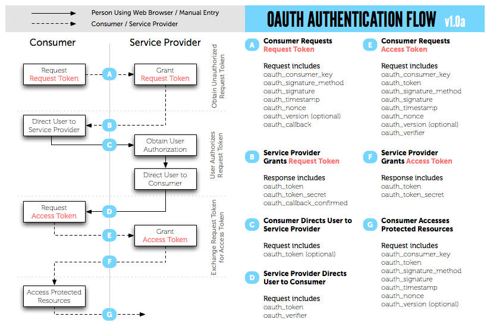

#Lesson 7 - API Design and Sessions

## README Table of Contents
* [OAuth](#oauth)
* [REST](#rest)
* [APIs](#apis)
* [Designing APIs](#design-apis)
* [Accessing APIs with OAuth](#access-apis)
* [In-Class Activities](#inclass-07)
* [Homework](#homework-07)

<a name="oauth"></a>
##OAuth: What it is and how it works

OAuth, which stands for "Open Authorization" is a simple and standard authentication process that provides users with a way to allow internet users to authorize external websites or applications to access their info without sharing their passwords. OAuth plays two roles in accessing data - **authentication** and **authorization**.

Authentication is handled by assigning two unique values to each application when they are registered with the service. These values are known as a **key** and a **secret**. The key serves as a public identifier for the application, and the secret is used to reversibly encrypt information about an OAuth API request. If the service provider is able to correctly decrypt the data sent along with the request using the secret it has assigned to the application, it considers this verification that the requester is who it says it is. This method of authentication is known as signing.

Authorization occurs after your application has been authenticated by the service, and requires that you redirect the user to their OAuth authorization page. There, the service can authenticate the user using their own auth flow, and ask their permission to give you access to their data. If the users says yes, they are redirected back to you, and you get a special access token that allows you to request data specific to that user.


*Example authorization page for Facebook.*

You'll find that some services like Facebook have different levels of permissions, each of which will give you an access token which only allows access to data within each permission tier.

The full exchange of requests involved in OAuth can be seen in the graphic below. You can read more about OAuth on the [official website](http://oauth.net/).


*Image via oauth.net*

Please read the following post on OAuth for more detailed information on how authorization works: [Oauth](http://www.cubrid.org/blog/dev-platform/dancing-with-oauth-understanding-how-authorization-works/)

<a name="REST"></a>
##REST

Please read this introduction on REST to get more information:[REST](http://www.infoq.com/articles/rest-introduction)

<a name="apis"></a>
##APIs: You're *real* on-ramp to the information superhighway


*Get in loser, we're going to programmatically acquire ~~JSON~~ data.*

So we've spent some time making our own web services that deliver static and dynamic page content, and we've done it all with the semantics of REST (GET, POST, PUT, DELETE). Today we see how we can use REST APIs to deliver content other than webpages (data!), and how we can access existing APIs set up by some of our favorite websites. Let's get started.

##What's an API?
Generally the acronym API (Application Programming Interface) is used to describe the way in which one piece of software exposes some of its functionality for another piece of software to use. When we talk about APIs in this class we're going to be specifically referring to web APIs, which most commonly expose their functionality through a specific URL or set of URLs. The APIs we'll be working with will allow you to programmatically (read: without a browser) GET and POST data from 3rd party web services.

##Some Examples
There are a lot of APIs out there that give you access to more types of data than you'll ever know what to do with. You can check out a long but by no means exhaustive list [here](http://www.programmableweb.com/category/all/apis?data_format=21190). That's a lot of data sitting there for the taking!

###Twitter
Search for tweets and users, post statuses, read entire timelines (all tweets from a user's following list), and more. Useful for gathering large amounts of data for natural language processing, creating a better interface for twitter, analytics platforms, or tweeting bots! **Examples:** [Tweetbot Twitter client](http://tapbots.com/software/tweetbot/), [Tospy Analytics](http://topsy.com/analytics), [Pixelsorter Bot](https://twitter.com/pixelsorter)

>**URL Endpoint:** https://api.twitter.com/1.1

>**Data Format**: JSON

>**Account Creation:** Automatic key assignment

>**Auth Scheme:** OAuth 1.0a

>**Documentation:** https://dev.twitter.com/rest/public

###Last.fm
Get information on music artist, albums, and individual tracks. Get listening trend data, even venue and event info. You can also use this API to record users' track listens (called scrobbling) to Last.fm. **Examples:** [Tastebuds Music-based Dating](http://tastebuds.fm/), [Last.fm Extra Stats](http://www.last.fm/user/C26000/journal/2006/07/30/383m_last.fm_extra_stats), [Spotibot Playlist Generator](http://www.spotibot.com/)

>**URL Endpoint:** http://ws.audioscrobbler.com/2.0/

>**Data Format**: XML/JSON if requested

>**Account Creation:** Apply for key

>**Auth Scheme:** Proprietary

>**Documentation:** http://www.last.fm/api

###Dropbox
Access all your files stored online! Put them up, take them down, share them with others, read metadata and revision history. The possibilities really are endless on this one. **Examples:** [Filepicker upload plugin](https://www.filepicker.io/), [Gimmebar Browse Plugin](https://gimmebar.com/), [Droptunes Music Streaming](http://droptun.es/)

>**URL Endpoint:** https://api.dropbox.com/1

>**Data Format**: JSON & Various File Formats

>**Account Creation:** Automatic key assignment

>**Auth Scheme:** OAuth 1.0

>**Documentation:** https://www.dropbox.com/developers

###US Gov
A lot of government agencies have created APIs to access public data. You can see a list [here](https://www.data.gov/).

###CURL
When first accessing an API (especially one with poor documentation), you don't want to have to write a lot of code just to view the output of the request. You can use the command line tool CURL to quickly make requests.

Example GET request:
```
curl http://services.faa.gov/airport/status/SAN?format=application/json
```

You can actually use curl to test your own server's routes too. Just start your server in one terminal, and in a separate terminal window, point curl at localhost:PORT/routeYouWantToTest. Later we will learn how to programatically test routes, but curl is nice if you want to see how the data looks to the client.

<a name="design-apis"></a>
##Designing APIs with REST-ful Semantics
Up until now, we've only had experience using URL routes that we created ourselves, all used for interacting with web pages. In this lesson, we've started exposing you to APIs other people have designed specifically for you to use. What about when *you* want to create an API for *other people* to use? We won't go into detail about picking what kind of data or functionality to expose, as that will vary based on your application, but what we will cover is _how_ to expose that data and functionality in a way that is easy for others to understand and use.

###GET and PUT
When designing a REST API, it's best to think of GET and PUT routes as reciprocal methods. When you ask to PUT a resource at a specific route, you should get that same resource back when you GET it. Of course, this really only applies to those routes in which we match some identifier for a resource (like `/cats/bycolor/:color` in homework 3). As an example, suppose we have a messaging website that has a unique id for every message created. We can see any specific message through our API by GET-ing `/messages/:id`. Similarly we could update a message by PUT-ing the updated information to `/messages/:id`.

###POST
One thing a lot of people struggle with is knowing when to use POST vs. PUT. If you think of the example above, however, it should be pretty obvious to you. If PUT is used for putting a resource at a route, a POST request is used for any route where you might want do something that modifies the database or server in some way, but not in a way that is reciprocal with a GET request. For example, you could provide a single route for creating messages `/messages/new`, which will take care of making a message that could then be GET-ed and PUT-ed by its assigned id. You can't really think of any reasonable reciprocal for `/messages/new`, can you? It wouldn't make sense to return the last message created, so we would just have the one method available on routes like that.

###DELETE
Probably the most self-explanatory method available to us. DELETE requests should only be used when we want to remove the resource at the URL we send the request to. Say we accidentally sent a _really_ embarrassing message to one of our professors. With a DELETE request we can make sure that `/messages/:embarrassing_message_id` returns a 404 by getting rid of the message altogether. Crisis averted!

###Naming Routes
To get started designing an API, you're going to need to come up with some routes that describe the content or functionality we are going to provide. One strategy we will try to stick to throughout the course is using **semantic routes**. This means that you should read the route, along with the method you'll use to request it, and from that alone have a good idea of what the result will be. What would you expect the following requests to do?

```
POST /blog/new
```
```
POST /login
```
```
GET /teacher/evan.simpson
```
```
DELETE /cats/age/15
```

Let's look at what's going on here. We'll start by examining the first part of the path, which we call the **collection**. Yes, this encompasses the same concept of collection as in MongoDB, but it is just a (convenient) coincidence we call them both that. Some collection routes we've used in the past include `/cats`, and `/ingredients`, and they describe the type of resource we are trying to access or manipulate. The next part of our paths will generally specify the action or resource, like `/cats/new` or `/ingredients/:name`. We can add specificity by extending a route as in `/cats/bycolor/:color`. Now of course, since we've been showing you the right way to create routes since the beginning, it's likely none of this is news to you, so let's look at some examples of bad, non-semantic URLs so you can appreciate the good ones. As always, Wikipedia has some great examples:

Non-semantic URL | Semantic URL
---------------- | --------------
`http://example.com/index.php?page=name` | `http://example.com/name`
`http://example.com/index.php?page=consulting/marketing` | `http://example.com/consulting/marketing`
`http://example.com/products?category=2&pid=25` | `http://example.com/products/2/25`
`http://example.com/cgi-bin/feed.cgi?feed=news&frm=rss` | `http://example.com/news.rss`
`http://example.com/services/index.jsp?category=legal&id=patents` | `http://example.com/services/legal/patents`
`http://example.com/kb/index.php?cat=8&id=41` | `http://example.com/kb/8/41`
`http://example.com/index.php?mod=profiles&id=193` | `http://example.com/profiles/193`
*Source: http://en.wikipedia.org/wiki/Semantic_URL*

Now if we combine everything we've learned about REST methods, semantic paths, and Wikipedia being a great resource for explaining things graphically, we get something like the following table.

Resource | GET | PUT | POST | DELETE
---------|-----|-----|------|-------
**Collection URI**, such as http://example.com/resources/ | List the URIs and perhaps other details of the collection's members. | Replace the entire collection with another collection. | Create a new entry in the collection. The new entry's URI is assigned automatically and is usually returned by the operation. | Delete the entire collection.
**Element URI**, such as http://example.com/resources/item17 | Retrieve a representation of the addressed member of the collection, expressed in an appropriate Internet media type. | Replace the addressed member of the collection, or if it doesn't exist, create it. | Not generally used. Treat the addressed member as a collection in its own right and create a new entry in it. | Delete the addressed member of the collection.

*Source: http://en.wikipedia.org/wiki/Representational_state_transfer*

###Versioning with Accept headers
One thing you almost always see API providers doing in a way that is not semantic is specifying the version of the API to be used for the request by prefixing it to the resource route. Can you guess why this isn't semantic? That's right - the route is supposed to describe the resource, and our API version does not (or should not) do that. Thankfully, we know better than that, so where else can we put it? In the HTTP headers! Specifically the `Accept` header. The API version value would look something like `application/vnd.myapp.v1`, added to whatever values need to be sent in the `Accept` header. Then in our application, we can check it easily with the `accepts` package (install via npm):
```js
var accepts = require('accepts');

app.use('/api*', function(req, res, next) {
  var accept = accepts(req);
  if (accept.types('application/vnd.myapp.v1')) {
    next();
  } else {
    return res.json(400, {
      message: "Incorrect API version"
    });
  }
});
```

<a name="access-apis"></a>
##Accessing Public APIs with OAuth
You might have noticed that some of the above APIs are listed as having an OAuth auth scheme, but you probably have no idea what that means. Sometimes, a 3rd party application might want access to private user data, but you can't reasonably expect web service providers to give that information out freely - we need a way for service providers' users to authorize 3d party applications to access their data. OAuth lets us do just that. **Note:** We're going to assume that throughout this course you will only be consuming APIs which require OAuth and not creating them.

###Signing In with OAuth
You can also use OAuth to handle user login. You've probably seen websites with "Log in with Google" or "Log in with Facebook" buttons -- those buttons access the Google or Facebook API to sign you in with your Google or Facebook credentials, then save your user information to session just like you would manually. We'll use an NPM package called Passport to handle OAuth-type user login.

#### Sessions and Cookies
Before we talk about using Passport for user authentication, we need to talk a bit about sessions and cookies.

Apps usually handle authentication by saving your information to a session, which is a store of information about the current user. The session will be restarted if it already exists or created if it's your first time using the app. A session usually works by associating a cookie with a user; a cookie is a small amount of information which is sent back and forth between the server and the browser. There are two types of cookies, but for all our purposes we will stick to session cookies, which are deleted from the browser when the page is closed (the other type is a persistent cookie, which isn't deleted from the browser when the page is closed). Usually our cookies will just contain the session id, because we will use the server to hold most of the user's data.

There's an npm module called `express-session` which is great for managing user sessions. To install this module into your app type:
```
npm install --save express-session
```
...and then `app.use` the module as middleware:
```javascript
var app = express();

app.use(session({
  secret: 'superS3CRE7',
  resave: false,
  saveUninitialized: false ,
  cookie: {}
}));
```
Aaaand we are done with adding basic sessions to our app. Not too complicated! Let's go through the options object you pass into the session function. The first attribute, `secret`, is used to sign the session ID cookie (basically to make it difficult for people to access the data in the session). `resave` determines whether an existing session will be saved to the database even if it was not updated during a request. Similarly, `saveUninitialized` determines whether a new session will be saved to the database even if it was not updated during a request. `false` is a good default option for both.

The `cookie` attribute allows you to describe the session ID cookie. If you don't define it, it will default to:
```
{ path: '/', httpOnly: true, secure: false, maxAge: null }
```
Within `cookie`: the `path` attribute describes where the cookie is created. `httpOnly` determines whether you can access the cookie from the client. `secure` determines whether HTTP in addition to HTTPs is able create sessions. `maxage` determines when the cookie is destroyed.

Let's talk about some specific uses for sessions.

You could track visits to a page like this:
```javascript
app.get('/', function(req, res, next){
    var sess = req.session;
    if (sess.views) {
        sess.views++;
    } else {
        sess.views = 1;
    }
    next();
}, function(req, res next) {
    res.send('Views: ' + sess.views);
});
```
This block of code checks the current session to see if the user has visited the page and increments the views attribute on the session if it exists, or creates it otherwise. The `next()` at the end passes control to the next handler... in this case, the function which `res.send`s the number of views.

You can also set sessions to expire, forcing the user to login again, which you often see on sensative sites like banking apps. This will be part of the inclass work so I won't write up an example here. However, if you have any more questions about sessions and cookies, you can read more about [express-session](https://www.npmjs.com/package/express-session) and follow a tutorial [here](http://expressjs-book.com/index.html%3Fp=128.html).

#### Using Passport
Passport lets you ask your users to log in via Google or Facebook, then manages the relevant sessions for you. That's it! All of the OAuth craziness is abstracted away.

###OAuth By Hand
We have an small example application using OAuth in the `word_cloud` folder in this lesson folder that will use Twitter's API to generate a word cloud. This example will show you how to build an OAuth request from scratch. While we hope you won't have to do that out in the real world unless absolutely necessary, we thought it might be nice to show you one so you can appreciate all of the heavy lifting some of the OAuth libraries take care of for you.

###Can I set up my own OAuth server?
So you want to use OAuth to authenticate and authorize your API users, huh? Unfortunately that's _just_ outside the scope of this class, but know that if you do get to that point someday, there are some great packages available (on npm) that can help you get a basic setup running fairly quickly.

<a name="inclass-07"></a>
#In-Class Activities
##Facebook Design Activity
You are designing Facebook's Page API. Come up with a set of routes to "Publish and send content as a Page. Manage Facebook Pages from your app." (Facebook's Page API documentation). When done, read and compare [Facebook's API](https://developers.facebook.com/docs/pages) documentation to your mock API, and have a discussion in your group about what is different and what is the same.

##Simple Session App
Create a simple app that does the following:
* Redirects to /login if user tries to access / without logging in.
* Lets a user login by entering their name into a form.
* Redirects to / after login and displays "Hello [name]."
* OPTIONAL: display login time and/or number of times user has viewed page in addition to "Hello [name]."

If you'd like to see how we implemented a simple session app, check out [this example](https://github.com/olinjs/olinjs/tree/master/lessons/07-apis-debugging/sessionExample).

##Aging Cookies
Discuss with your group the difference between a cookie and a session, and when are cookies and sessions created and destroyed. Play around with your app; how can you remove the session/cookie so the user has to login again?

##Passport Example
Check out the [Passport example](https://github.com/olinjs/olinjs/tree/master/lessons/07-apis-debugging/passportExample) -- pull it and follow the instructions in the readme in that folder to get it running.

Read through the code -- what makes sense to you? What's confusing? How will you add Passport to Twoter?

##OPTIONAL: Production
We haven't discussed creating/deploying apps for production yet, but it is important to highlight the following point. If you read the documentation of   `express-session` you might have seen something like:

**Warning** The default server-side session storage, MemoryStore, is purposely not designed for a production environment. It will leak memory under most conditions, does not scale past a single process, and is meant for debugging and developing.

Let's try using a different session store with our app. Since we have MongoDB set up already, integrate one of these two stores into your app.
    - [connect-mongodb-session](https://www.npmjs.com/package/connect-mongodb-session)
    - [connect-mongo](https://www.npmjs.com/package/connect-mongo)

If you have finished all of the above, start the homework for next time (adding Passport to Twoter).

<a name="homework-07"></a>
# Before Class 8 (Friday 2/14/17)

#### Passport and "Sign in using __"
One of the great features of OAuth is that it allows us to use another service to authenticate users of our service. This means we can piggy back on someone else to handle the hard parts of signing in to a service. The library `Passport` makes this really easy, if not a bit complicated.

#### Assignment
Read a little bit [about Passport](https://github.com/jaredhanson/passport/blob/master/README.md#passport), and then [this tutorial](http://mherman.org/blog/2013/11/10/social-authentication-with-passport-dot-js) they've linked in the documentation. You should aim to understand how to integrate Passport into an Express application to handle user sign in. Don't get hung up on the term 'Strategy,' it's just Passport's way of saying 'method of authentication.'

This week we're going to be using Twoter as a base for your exercise and ask you to do the following things:

1.  Allow users to sign in to your service using Facebook
2.  Use Passport's LocalStrategy to sign users in with a username and password.
3.  **DO NOT PUSH YOUR OAUTH KEYS TO GITHUB**
4.  Only display Twotes on `/` if the user has been authenticated
5.  Try to keep all of you Passport logic out of `app.js` like we've been doing with all of our other routes. How might you go about this?
6.  Don't push to Heroku until we've had a chance to evaluate the functionality of Homework 6 separately. We will notify you when you can deploy.
6.  **DO NOT PUSH YOUR OAUTH KEYS TO GITHUB**

###### Getting set up with FB OAuth
In order to use Passport with Facebook, you'll need an application ID and secret key. You can get these by signing up as a developer on [Facebook's developer website](https://developers.facebook.com/) and creating a new application (under 'My Apps'). The only setting you will need to change for this application is to set 'Site URL' to `http://localhost:3000` so Facebook knows where to redirect OAuth requests. Note that when you deploy to Heroku, you will need to change this to your apps `herokuapp.com` address.

When we start working on projects, you might want to have a live version of your site deployed while you continue to work on it locally. In order to do this, you might consider having two Facebook applications: `my-app` and `my-app-dev`. Then you can set up your local application to use `my-app-dev`, and your deployed site to use `my-app`.


#### Submitting
When you're done with your app, fill out the [Twoter homework survey](http://goo.gl/forms/u5MDLduyFz). The survey is your submission for homeworks 6 and 7.
