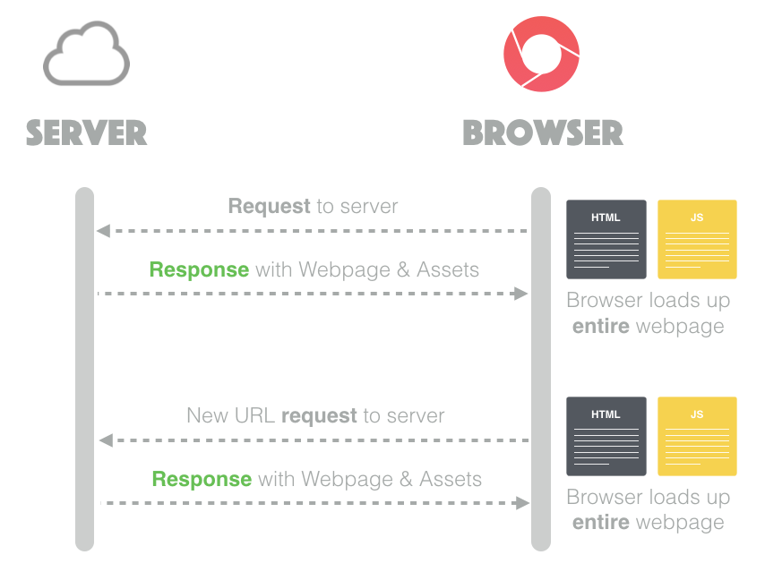
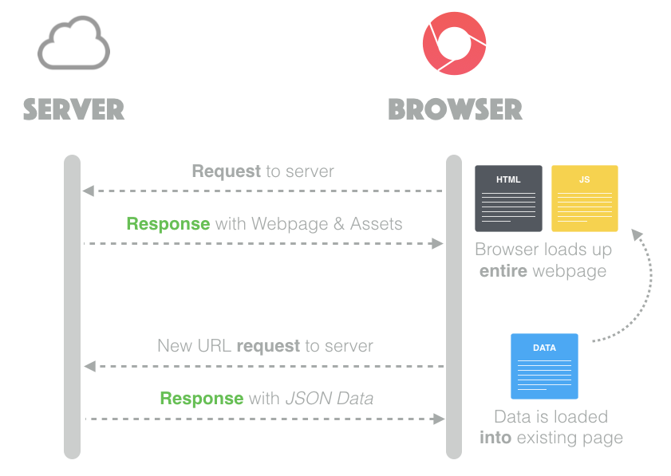
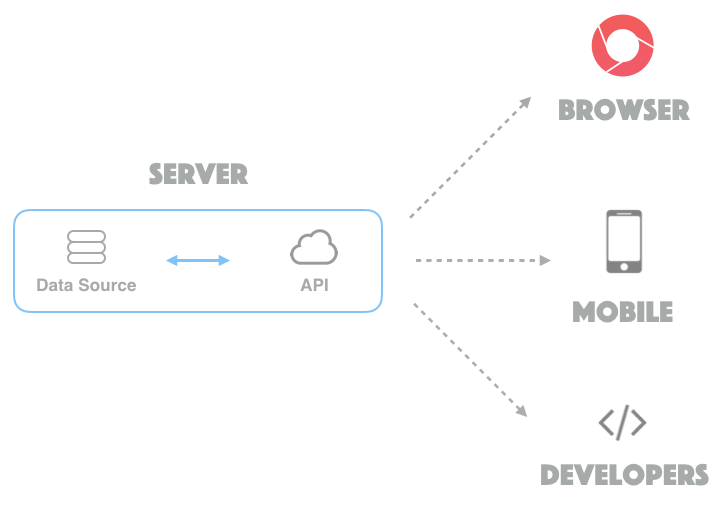

#Lesson 9 - Client-side Javascript Frameworks

## README Table of Contents
* [Client-Side Frameworks](#client-side)
* [In-Class Activities](#inclass-09)
* [Homework](#homework-09)

<a name="client-side"></a>

----------------------
##Introduction

So far we have seen how to organize an increasingly complex system of components on our node server.
We will now take a side step to discuss another organizational system in which instead of having lot of structure on the **server**, we have that structure on the **client**, providing a structure (a "framework") for organizing and manipulating the user interface.

##Current Idea
In our traditional system, with most clicks you make a call to your server for an html page.
You have seen how this can work with templating by rendering html on the server and then sending it across to the client as just html.
The image below shows this traditional system:


But what if instead of having to load an entire HTML document every time, you simply send **only the necessary** pieces of data and then change the html using Javascript code?
You have tried doing this before, most notably in the burger ordering homework.
You probably noticed how messy that got for even a simple application.
You also know about APIs and how you can retrieve structured data and show it on your page.
Now consider a different structure in which almost your *entire server is simply an API* that sends data to a single page that changes appropriately.
In this structure the server would serve only a few different assets and include an API that can be used to request the necessary data.
In that case the communications would look like this:


This clearly has the benefit of almost certainly lowering the amount of data that is transferred between the server and the client, which also lowers the loading time when clicking on links.
Another benefit of this application structure is that the API component can be used for many other purposes, such as mobile applications or even to other developers who want to expand on your websites functionality, as diagrammed below:


You may wonder why this is not how it has always been done. The simple answer to this is that it is only recently that Javascript, browsers, and computers have gotten good enough to reliably utilize these client-side frameworks. If you were going to do anything interesting, you had to do it on the server. In addition, this method may be more labor intensive for certain projects and can be a tricky adjustment to make. You will get to explore some of these strengths and weaknesses in the next lab assignment when you tackle one of these frameworks yourself.

##Your First Client Templating
So you are all very familiar with server side templating using handlebars.
In the Lesson 9 folder there is an in_class folder containing the cat app that you are all familiar with.
We are going to uncomment code to transform just one of the routes into an API endpoint and then use handlebars on the client side to render the content.

You can probably imagine that organizing a very complex application with dozens of pages and models can get really complicated and messy really fast.
Luckily, there are really fantastic publically available and free frameworks you can utilize to organize your application.
We will explore these in a bit.

##MVC on the client
We talked last class about MVC and how **awesome** it is.
Hopefully you all have an appreciation for the nice structure and separation of concerns it affords you.
When we restructure our application for the client side, we now move that organizational structure to the client side, as well.
The direct implementation will differ based on the specific framework, but in general you will organize your **views** as templates that you load in only once when the first page loads.
The **models** are organized javascript objects with some additional functionality, such as a link to an API endpoint that can be used to retrieve and update data.
The **controller** is also on the client where it handles rendering the templates using the appropriate model data.

##Popular Frameworks
It turns out that there are a TON of different javascript client-side frameworks to choose from for any project.
These frameworks have various strengths and weaknesses. In this class we are going to explore AngularJS and ReactJS, however, you are more than welcome to explore other templates on your own.
The source code for all of these frameworks are available on github (and yes, you can fork them).

Framework | Github | Homepage
--- |---|---|
Angular | https://github.com/angular | https://angularjs.org/
Backbone | https://github.com/jashkenas/backbone | http://backbonejs.org/
Ember | https://github.com/emberjs/ember.js/ | http://emberjs.com/
React | https://github.com/facebook/react | http://facebook.github.io/react/
Flight | https://github.com/flightjs/flight | https://flightjs.github.io/
Knockout | https://github.com/knockout/knockout | http://knockoutjs.com/
Riot | https://github.com/muut/riotjs | https://muut.com/riotjs/

Every framework has different features and organizational structures. Best way to understand these differences is to visit the webpage of the framework and just try to implement some very basic system in the framework. Let's look into more detail as to what Angular and React entail.


####Angular:

Angular is developed by Google and has as its chief aim to make html what it would be if it was created today. It has several interesting qualities such as html directives. A primary focus of angular is to build for testability and it has functionality to help enable exactly that.

 **Highlight** - Two-way data binding: Angular has event listeners attached to data changes in an application; whether it is by the user or by the database, Angular knows to update all relational content. Two-way data binding also reduces the amount of code needed to develop sleek interaction and content transitions.


####React
Developed by Facebook and focuses on the view part of MVC. Mission statement is to allow users to create large applications with data that changes over time. Allows its views to update as the data changes.

**Highlight** - Virtual DOM: React works by creating a virtual DOM in pure JavaScript that acts as an intermediate representation of the DOM. This way, React is able to create a diff of your active DOM and your virtual DOM to decide which elements to change, thereby providing great rendering performance.

##Approaches to learning a framework
As you almost certainly are aware, for any material (such as a framework) there are dozens of ways to learn a framework. A big part of the upcoming lab is learning a framework and presenting on what you found effective in learning that framework. There are a couple of approaches you can take to learning any new framework or library and we will be going over a few of them here.

**Documentation**

Any framework or library will always have documentation that you can read through to understand the independent functions and components. If done well, this documentation can be useful towards helping you understand the options available to you, as well as being vital as a quick check on the signature of functions and such. The drawback of these is that documentation is often poor, technical, and doesn't give a very good high level idea of the patterns of the framework.

**Third-Party Explanations / Courses**

For lots of popular frameworks, there are often lots of people who have created excellent walkthroughs of the framework. They (often) do a good job of taking the listener through a logical explanation of the framework, building on top of content previously explained, and showing how you can build an actual application with the framework. These can, however, take some time to go through, cost money, and depending on your skill/ familiarity they can feel too fast or too slow. You should be able to find plenty by simply Googling "____ tutorial" but if you are stuck, here are some popular possibilities:
- https://egghead.io/ (Angular and React)
- https://www.codeschool.com/ (Backbone, Ember, & Angular)(warning: paid service)
- http://emberjs.com/guides/ (Ember)
- http://arturadib.com/hello-backbonejs/ (Backbone)


**Sample Apps**

There are applications that are written specifically as example applications to show how to put an application together with actual functionality. These can be found often from the framework publishers themselves, but also from people who just want to share. One excellent page that has a sample app for many frameworks is: http://todomvc.com/

Additionally, if the framework is popular enough, it likely also has hundreds of actual applications that have been written in the framework and are publically available. All these can be sources of learning from experts who likely are very familiar with the framework. They can, however, be very hard to dig through and are by no means necessarily well done or structured so you shouldn't take them as the only or best way to use the framework.

##REACT
**For this semester, we are going to be utilizing React as our client-side framework. React is widely used by software companies, and is extremely efficient due to the fact that it creates its own virtual DOM. Read and follow the tutorial in the following readme: [REACT](./REACT/README.md)**


<a name="inclass-09"></a>

----------------------
# Lesson 8 In-Class Exercises

##Endless possibilities
React and Angular are two of the most popular client-side frameworks. While we will be using React in this class, it's useful to know how different approaches work. Comparing React and Angular is very difficult due to their fundementally different approaches to organizing your client-side code. Both frameworks have pros and cons and which one you should use varies both on your personal taste and the project you are working on. Pay particular attention to the following keywords:

####Angular
- Two-way data binding
- Controllers
- Services
- Directives
- Scopes

####React
- Virtual DOM
- ReactComponents
- JSX
- State vs Props
- Uni-directional Data flow
- Flux


<!-- ##History
Angular has been around for a while. Since 2009, Angular has been assigning custom attributes, known as directives, to the HTML elements of the DOM to provide them with more advanced functionality. Angular is mature, commonly used, and there are a ton of great resources for getting up and running with it. React is quite young. Created by Facebook in 2013, React has presented itself as a new paradigm of web development. React eschews the normal separations of concerns, page layout in html, interaction in javascript, and style in css, for a new approach; self contained and modular components. These components define the layout and logic of a component (like a button) in one place. You can then reuse and nest these components to create complex interfaces. On top of this, React boasts a performance-minded view renderer capable of rendering large amounts of data without missing a beat. (Note, a new version of Angular, Angular 2, has recently entered beta which is a fundemental redesign of Angular, taking many cues from React. While we are excited to see Angular 2, we can't in good concious recommend using it yet as the documentation is still incomplete and not ready for production.)

##Research
- Find Angular and React documentation online. Pay particular attention to the following keywords:

####Angular
- Two-way data binding
- Controllers
- Services
- Directives
- Scopes

####React
- Virtual DOM
- ReactComponents
- JSX
- State vs Props
- Uni-directional Data flow
- Flux

Here are some links to start you out:
- [Angular Conceptual Overview](https://docs.angularjs.org/guide/concepts)
- [Angular Data Binding](https://docs.angularjs.org/guide/databinding)
- [Why Build React?](http://facebook.github.io/react/blog/2013/06/05/why-react.html)
- [A Closer Look into React by Pete Hunt](https://www.quora.com/profile/Pete-Hunt/Posts/Facebooks-React-vs-AngularJS-A-Closer-Look)
- [JSX](https://facebook.github.io/react/docs/jsx-in-depth.html)

##Hello Angular
Here's just about the simplest Angular app you can write. The words you type in the textbox will show up after "Hello" in the `<h1>` tag.
```html
<!DOCTYPE html>
<html ng-app>
<head>
    <title>Hello World, AngularJS</title>
    <script type="text/javascript" src="https://ajax.googleapis.com/ajax/libs/angularjs/1.0.7/angular.min.js"></script>
</head>
<body>

    Write some text in textbox:
    <input type="text" ng-model="sometext" />

    <h1 ng-show="sometext">Hello {{ sometext }}</h1>

</body>
</html>
```
The first thing we notice is the use of an attribute **ng-app** with the html tag. This attribute, known as a directive, signals Angular to be active in this portion of the page. Another important thing to note is the use of the **ng-model** directive. **ng-model** binds the state of the textbox with the model value, i.e. "sometext". As a result, whenever the textbox value changes, Angular authomatically changes the model "sometext" to the respective value. This is what is known as Two-way Data Binding. Moreover, **{{sometext}}** tells Angular to bind the value of the model "sometext" in its place. Finally, the **ng-show** directive conditionally shows an element, depending on the value of the relative boolean expression. It's default state is False, and one could also use **ng-hide**, which does exactly the opposite of **ng-show**.

 -->

##ToDo App
If you're done, start thinking about how you'll build your todo app for homework. With your group, discuss:
- Which framework do you want to use?
- How is what you're doing with a framework different from what you did with jQuery before?
- How will the server communicate with the client?
- On the board, map out the "boilerplate" for an app which uses a framework.

<a name="homework-09"></a>

----------------------
# Before Class 10 (Friday 2/24/2017)

#### Assignment
Create a ToDo List App using a fronted framework, as for example shown [here](http://todomvc.com/examples/angularjs/#/), using Angular or React. Think about what routes your API needs to include for this application to function. Your app should be able to:
- **Add** an item to the list
- **Edit** an item in the list
- **Save** an edit that took place in an item in the list
- **Remove** item from the list
- Keep a running count of the items to be completed
- Be able to separate/filter the items on the list:
	- All
	- Active
	- Completed
- Mark item as complete and append to "Completed" list
- Optional:
	- Undo edits

Fill out this [homework survey](https://docs.google.com/forms/d/1wivfR38EiZdwD3Gv5vZ3pWPSrSWORJil7a9P1xzTP-g/viewform?usp=send_form).
